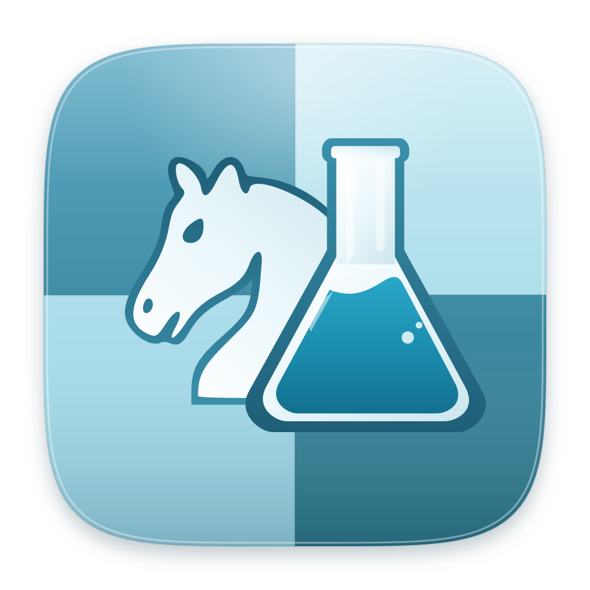

<div align="center">

[][website-link]

# ChessRTK

**A deterministic chess programming toolkit.**

**[Explore ChessRTK docs »][website-link]**

[Report bug][issue-link] · [Command reference][commands-link] · [PDF manual][manual-link]

[![License][license-badge]][license-link] [![Java][java-badge]][build-docs-link]

</div>

## Overview

[ChessRTK][website-link] (`crtk`) is a deterministic chess programming toolkit for
legal move generation, move validation, `perft` testing, FEN/PGN/SAN/UCI workflows,
Chess960, UCI engine analysis, puzzle mining, dataset export, SVG board rendering,
and native PDF publishing.

ChessRTK is not a single playing engine. It is the toolbox around chess engines and
chess data: a shared Java 17 rules core, a scriptable command line, a Swing desktop
Workbench, record and dataset pipelines, rendering tools, and publication tooling.
The same position model powers every surface, so legality, notation, tags, diagrams,
engine jobs, datasets, and books do not drift apart.

See the [documentation][website-link] for setup, examples, command help, Workbench
usage, dataset workflows, book publishing, and troubleshooting.

## Files

This repository contains:

* [README.md][readme-link], the file you are currently reading.
* [LICENSE.txt][license-link], the GNU General Public License version 3.
* [src][src-link], the Java source for the CLI, Workbench, chess core, engines,
  renderers, dataset writers, and regression tests.
* [scripts][scripts-link], build, documentation, release, and regression helpers.
* [wiki][wiki-link], the Markdown source for the generated documentation.
* [docs][docs-link], the generated documentation site and PDF manual.
* [assets][assets-link], logos, board assets, diagrams, screenshots, and social
  preview graphics.
* [native][native-link], optional CUDA, ROCm, and oneAPI native backends.

Large local model weights belong under `models/` and are intentionally not tracked.

## Using ChessRTK

Install the launcher on Debian/Ubuntu-style systems:

```bash
./install.sh
crtk doctor
```

Run a few deterministic chess-programming checks:

```bash
crtk fen print --startpos
crtk move list --startpos --format both
crtk engine perft --startpos --depth 4 --threads 4
crtk engine bestmove --fen "<FEN>" --format both --max-duration 2s
```

The command grammar is noun-then-verb:

```text
crtk <area> <action> [options] [args]
```

Examples include `crtk move list`, `crtk engine perft`,
`crtk engine bestmove`, `crtk puzzle mine`, and `crtk book render`.

Start the desktop Workbench:

```bash
crtk workbench
```

If the launcher is not installed, use the jar or classpath entry point:

```bash
java -jar crtk.jar help
java -cp out application.Main help
```

Read the [getting started guide][getting-started-link] and
[command reference][commands-link] for the full command surface.

## Compiling ChessRTK

ChessRTK builds with the stock JDK. There is no Maven, no Gradle, and no third-party
Java dependency tree. Always compile for the Java 17 release:

```bash
find src -name '*.java' | sort > /tmp/crtk-srcs.txt
javac --release 17 -d out @/tmp/crtk-srcs.txt
jar --create --file crtk.jar --main-class application.Main -C out .
```

Or use the regression runner:

```bash
./scripts/run_regression_suite.sh build
./scripts/run_regression_suite.sh jar
```

See [Build and Install][build-docs-link] for prerequisites, install paths, optional
UCI engines, model files, and native GPU backends.

## Contributing

ChessRTK prioritizes deterministic behavior and one shared chess core. Changes to
legality, notation, engine workflows, rendering, datasets, or publishing should keep
outputs stable and should update the docs when behavior changes.

Before sending changes, run:

```bash
./scripts/run_regression_suite.sh recommended
```

See [Development Notes][development-link], [Quality and Testing][quality-link], and
[AI Agents][agents-link] for repository conventions, test targets, and reproducible
agent workflows.

## Terms of use

ChessRTK is free software distributed under the
[GNU General Public License version 3][license-link].

You may use, modify, and redistribute it under the terms of that license. When you
distribute modified versions, keep the license and corresponding source available.
For research or published work, cite the repository and pin the commit hash or tag
used to produce your results.

[agents-link]: wiki/ai-agents.md
[assets-link]: assets
[build-docs-link]: wiki/build-and-install.md
[commands-link]: wiki/command-reference.md
[development-link]: wiki/development-notes.md
[docs-link]: docs
[getting-started-link]: wiki/getting-started.md
[issue-link]: https://github.com/LenniAConrad/chess-rtk/issues
[java-badge]: https://img.shields.io/badge/java-17%2B-1487a6?style=for-the-badge
[license-badge]: https://img.shields.io/badge/license-GPL--3.0-success?style=for-the-badge
[license-link]: LICENSE.txt
[manual-link]: docs/chessrtk-manual.pdf
[native-link]: native
[quality-link]: wiki/quality-and-testing.md
[readme-link]: README.md
[scripts-link]: scripts
[src-link]: src
[website-link]: https://LenniAConrad.github.io/chess-rtk/
[wiki-link]: wiki
