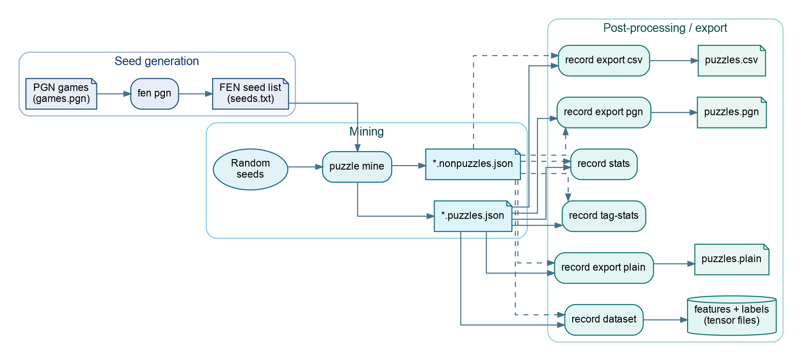
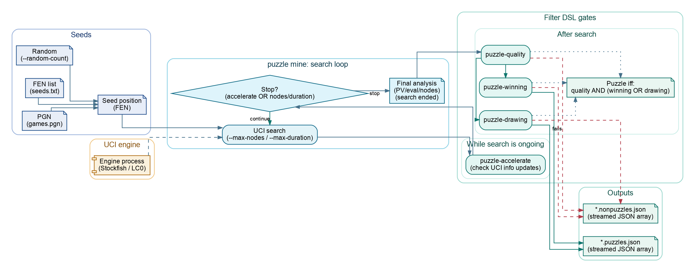

# ChessRTK (`crtk`)


ChessRTK is a reproducible Java 17 toolkit for chess research, puzzle mining,
move-generation validation, engine experiments, dataset export, tagging,
rendering, and chess-book publishing. The core chess stack is dependency-free
Java; UCI engines, neural weights, and native GPU backends are optional local
artifacts layered on top. It turns chess work into inspectable files, commands,
diagrams, tensors, PDFs, and repeatable runs.

The project has one practical bias: keep the interesting chess work explicit.
Positions are FENs, moves can be UCI or SAN, searches have limits, records keep
engine evidence, datasets ship metadata, and book output is generated directly
from source manifests. The same primitives work from a terminal, scripts, CI, or
agent workflows.

If ChessRTK saves you time, inspires an experiment, or helps you publish
something useful, please star the repository so other chess builders can find it.

CLI entry point:

```bash
crtk <command> [options]
```

Without installing the launcher:

```bash
java -cp out application.Main <command> [options]
```

## What It Can Do

| Goal | Commands to start with |
| --- | --- |
| Validate and normalize positions | `fen validate`, `fen normalize`, `fen chess960` |
| Inspect a board | `fen print`, `fen display`, `fen render`, `book pdf` |
| List, convert, and apply moves | `move list`, `move uci`, `move san`, `move both`, `move to-san`, `move to-uci`, `move after`, `move play` |
| Verify move generation | `engine perft`, `engine perft-suite` |
| Run an external UCI engine | `engine analyze`, `engine bestmove`, `engine threats`, `engine uci-smoke` |
| Search and evaluate in-process | `engine builtin`, `engine static`, `engine eval` |
| Generate and extract positions | `fen generate`, `fen pgn`, `fen chess960` |
| Tag positions and puzzle lines | `fen tags`, `puzzle tags`, `fen text`, `puzzle text` |
| Mine tactical puzzles | `puzzle mine`, `puzzle pgn` |
| Filter and reshape record dumps | `record files`, `record stats`, `record tag-stats`, `record analysis-delta` |
| Export ML datasets | `record dataset npy`, `record dataset lc0`, `record dataset classifier`, `record export training-jsonl`, `record export puzzle-jsonl` |
| Publish diagrams and books | `book pdf`, `book render`, `book cover` |
| Work in GUIs | `gui`, `gui-web`, `gui-next` |
| Check local setup | `doctor`, `config show`, `config validate`, `engine gpu` |

ChessRTK is a good fit for:

- chess researchers and engine experimenters
- puzzle miners and dataset builders
- authors producing diagram sheets, puzzle books, or covers
- automation workflows that need deterministic CLI output
- AI agents that need reliable chess primitives

It is not trying to be a consumer chess-playing app. It can display boards and
run desktop workbenches, but the heart of the project is deterministic command
execution.

## Core Capabilities

ChessRTK combines a Java-native chess core with research and publishing tools:

- Bitboard-backed legal move generation with make/undo, Chess960 castling,
  SAN/FEN support, attack helpers, pin helpers, and perft counters.
- Detailed perft reporting for nodes, captures, en-passant captures, castles,
  promotions, checks, and checkmates, with detailed, table, and engine-compatible
  `move: nodes` divide output.
- A self-contained perft suite for critical standard, Chess960, en-passant,
  promotion, castling, and stress positions. It compares stored truth values to
  the Java core move generator and never starts an external engine process.
- UCI engine orchestration for analysis, best moves, threats, WDL, MultiPV,
  node/time limits, threads, hash, and smoke checks.
- An in-process alpha-beta Java engine with a transposition table,
  quiescence search, move ordering, and classical, NNUE, or LC0 value
  evaluators for bounded local search and reproducible automation.
- Static and engine-enriched position tags covering facts, material, pawn
  structure, king safety, piece activity, tactics, eval buckets, WDL, phase,
  mobility, initiative, and development.
- Record pipelines that merge, filter, split, summarize, export, and convert
  analysis dumps into PGN, CSV, JSONL, NumPy, LC0-style tensors, and classifier
  tensors.
- Native PDF generation for diagram sheets, book interiors, and print covers.
- Board image rendering to windows, PNG/JPG/BMP/SVG files, and PDFs with
  arrows, circles, legal-move dots, board flipping, dark mode, and evaluator
  ablation overlays.
- Agent-friendly command shapes for deterministic move lists, notation
  conversion, FEN normalization, line application, best-move output, and
  regression checks.

## Quickstart

Requirements:

- Java 17+ JDK with `javac`
- Optional: a UCI engine on `PATH`, or a config in `config/*.engine.toml`, for
  external engine analysis and mining
- Optional: LC0/NNUE/T5 model files under `models/` for evaluator and text
  workflows

Build directly, with no Maven or Gradle:

```bash
mkdir -p out
javac --release 17 -d out $(find src -name "*.java")
java -cp out application.Main help
```

Install the `crtk` launcher on Debian/Ubuntu-style systems:

```bash
./install.sh
crtk doctor
crtk help
```

Fetch optional LC0J model weights:

```bash
./install.sh --models
```

Model files are local artifacts and are ignored by git. The default weights can
also be downloaded manually from:

- https://github.com/LenniAConrad/chess-models

More setup details: [wiki/build-and-install.md](wiki/build-and-install.md)

## First Commands

Inspect a position:

```bash
crtk fen print --fen "rnbqkbnr/pppppppp/8/8/8/8/PPPPPPPP/RNBQKBNR w KQkq - 0 1"
crtk move list --format both --fen "rnbqkbnr/pppppppp/8/8/8/8/PPPPPPPP/RNBQKBNR w KQkq - 0 1"
crtk engine bestmove --format both --fen "rnbqkbnr/pppppppp/8/8/8/8/PPPPPPPP/RNBQKBNR w KQkq - 0 1" --max-duration 2s
```

Normalize, validate, and transform FENs:

```bash
crtk fen normalize --fen "<FEN>"
crtk fen validate --fen "<FEN>"
crtk move after --fen "<FEN>" e2e4
crtk move play --fen "<FEN>" "e4 e5 Nf3 Nc6"
```

Check the engine and core move generation:

```bash
crtk doctor
crtk engine uci-smoke --nodes 1 --max-duration 5s
crtk engine builtin --depth 3 --format summary --fen "rnbqkbnr/pppppppp/8/8/8/8/PPPPPPPP/RNBQKBNR w KQkq - 0 1"
crtk engine perft --depth 4 --threads 4
crtk engine perft --fen "<FEN>" --depth 5 --divide --threads 4
crtk engine perft --depth 3 --format stockfish --threads 4
crtk engine perft-suite --depth 6 --threads 4
```

`engine perft-suite` is an internal regression check. It runs stored reference
positions through the Java core move generator and prints a progress bar followed
by a `Truth` / `Calculated` / `Speed` / `Match` table.

Generate tags, text, and diagrams:

```bash
crtk fen tags --fen "<FEN>" --include-fen
crtk fen tags --pgn games.pgn --delta --mainline
crtk puzzle tags --fen "<FEN>" --multipv 3 --pv-plies 12
crtk fen text --fen "<FEN>" --model models/t5.bin --include-fen
crtk fen render --fen "<FEN>" -o dist/position.png --arrow e2e4 --circle e4
```

## Pipeline Overview



ChessRTK is organized as small tools that compose:

1. Create or import positions from FEN, PGN, random legal generation, or
   Chess960 starts.
2. Analyze positions with a UCI engine or built-in evaluators.
3. Keep the useful records, measure stability, and filter with the DSL.
4. Export to CSV, PGN, JSONL, NumPy tensors, LC0-style tensors, diagrams, or
   PDFs.

Diagram source: `assets/diagrams/crtk-pipeline-overview.dot`

## Research Workflow

Mine puzzles from a PGN, then export the accepted results to CSV and PGN:

```bash
crtk fen pgn --input games.pgn --output seeds.txt
crtk puzzle mine --input seeds.txt --output dump/run.json --engine-instances 4 --max-duration 60s
crtk record export csv --input dump/run.puzzles.json --output dump/run.puzzles.csv
crtk record export pgn --input dump/run.puzzles.json --output dump/run.puzzles.pgn
```

Common puzzle-mining primitives:

- Mine random seeds: `crtk puzzle mine --random-count 200 --output dump/random.json`
- Mine continuously: `crtk puzzle mine --random-infinite --output dump/endless.json`
- Extract FEN seeds from games: `crtk fen pgn --input games.pgn --output seeds.txt`
- Filter records: `crtk record files -i dump/ -o filtered.json --recursive --puzzles`
- Measure stability: `crtk record analysis-delta -i dump/run.puzzles.json -o dump/run.analysis-delta.jsonl`

### Mining Gates



The mining pipeline uses explicit gates for quality, forcing moves, winning
tactics, drawing resources, and other tactical signals. The goal is not just to
find engine-approved moves, but to leave behind data that can be inspected,
filtered, replayed, and reused.

Diagram source: `assets/diagrams/crtk-mining-gates.dot`

## Dataset Workflow

Export tensors from mined or imported analysis records:

```bash
crtk record dataset npy \
  --input dump/run.puzzles.json \
  --output training/puzzles

crtk record dataset lc0 \
  --input dump/run.puzzles.json \
  --output training/lc0/puzzles \
  --weights models/leela_112planes-10blocksx128-policyhead80-valuehead32-policy4672-wdl3.bin

crtk record dataset classifier \
  -i dump/run.puzzles.json \
  -i dump/run.nonpuzzles.json \
  -o training/classifier/run
```

Available dataset shapes:

- `record dataset npy`: eval-regression tensors, including features shaped
  `(N, 781)`
- `record dataset lc0`: LC0-style input, policy, value, and metadata tensors
- `record dataset classifier`: 21-plane inputs and binary labels
- `record export training-jsonl`: coarse/fine FEN labels for training pipelines
- `record export puzzle-jsonl`: puzzle rows with LC0 policy information

More: [wiki/datasets.md](wiki/datasets.md)

## Publishing Workflow

Render a full puzzle book and a matching cover from the same manifest:

```bash
crtk book render -i books/puzzles.toml --check
crtk book render -i books/puzzles.toml -o dist/puzzles.pdf
crtk book cover -i books/puzzles.toml --check \
  --binding paperback --interior white-bw --pages 120
crtk book cover -i books/puzzles.toml -o dist/puzzles-cover.pdf \
  --binding paperback --interior white-bw --pages 120
```

Make a quick diagram sheet from a FEN list or PGN mainlines:

```bash
crtk book pdf --fen "<FEN>" -o dist/position.pdf
crtk book pdf -i seeds.txt -o dist/sheet.pdf --title "Training Sheet"
crtk book pdf --pgn games.pgn -o dist/games.pdf --page-size a5 --diagrams-per-row 1
```

ChessRTK writes native PDFs, so the publishing path does not require LaTeX.
Book and diagram rendering share the same `chess.book.render` helpers; SAN
solution text is converted to figurine algebraic notation before it is written
into tables and captions.

More: [wiki/book-publishing.md](wiki/book-publishing.md)

## Single-Position Toolbox


Useful commands when you are studying, scripting, or giving an AI agent a
deterministic chess primitive:

- `move list --format uci|san|both`
- `move uci`, `move san`, `move both`
- `move to-san`, `move to-uci`
- `move after`, `move play`
- `engine bestmove --format uci|san|both`
- `engine bestmove-uci`, `engine bestmove-san`, `engine bestmove-both`
- `engine builtin --format uci|san|both|summary`
- `fen normalize`, `fen validate`, `fen chess960`, `fen pgn`
- `engine static`, `engine perft-suite`, `record files`, `puzzle pgn`

Diagram source: `assets/diagrams/crtk-position-toolbox.dot`

## Command Map

Core command groups:

- `fen`: normalize, validate, generate, render, display, tag, summarize, and
  extract positions
- `move`: list legal moves, convert notation, apply one move, or play a line
- `engine`: analyze, choose best moves, search with the in-house Java engine,
  evaluate, inspect threats, run perft, and smoke-test UCI engines
- `puzzle`: mine puzzles, convert puzzle dumps to PGN, tag positions, and
  generate text summaries
- `record`: export, filter, merge, split, summarize, and convert record files
  into training datasets
- `book`: render diagram PDFs, puzzle-book interiors, and covers
- `gui-next`: launch the Studio GUI v3 research workbench
- `config`: show and validate resolved configuration
- `doctor`: check the local runtime, config, engines, and artifact paths

Full command reference: [wiki/command-reference.md](wiki/command-reference.md)

## Implementation Notes

The chess rules implementation is the Java-native `chess.core` package. It
contains the bitboard-backed `Position`, strict FEN/SAN helpers, Chess960 setup
logic, legal move generation, make/undo support, attack/pin helpers, and
perft-facing APIs. Detailed perft and the self-contained reference suite live in
`chess.debug`, so the debug tools exercise the same move generator used by the
CLI, tags, renderer, and engine.

Rendering-specific movetext formatting lives with the book renderer as
`chess.book.render.MoveText`; shared numeric clamp helpers live in
`utility.Numbers` to keep small generic utilities in one place.

More: [wiki/development-notes.md](wiki/development-notes.md)

## Built-In Engine and Optional Evaluators

`engine builtin` is ChessRTK's in-house Java engine. It exists as an
in-process search and benchmarking target, not as a top-tier engine meant to
compete with mature UCI engines. It is useful when you need deterministic CLI
search without starting a UCI process, when a workflow needs bounded search on
a machine with no engine configured, or when you want a reproducible baseline
for puzzle-solve timing.

```bash
crtk engine builtin --depth 4 --nodes 100000 --format summary --fen "<FEN>"
crtk engine builtin --depth 20 --fen "<FEN>"   # UCI-style info depth lines + bestmove
crtk engine builtin --evaluator nnue --weights models/crtk-halfkp.nnue --fen "<FEN>"
crtk engine builtin --lc0 --weights models/leela_112planes-10blocksx128-policyhead80-valuehead32-policy4672-wdl3.bin --fen "<FEN>"
```

ChessRTK supports two LC0-related paths:

- LC0 as a UCI engine for mining and analysis, usually with `.pb.gz` weights
- the built-in Java LC0 evaluator for `engine eval`, `fen display`, and
  ablation-style inspection, using local `models/*.bin` weights

The built-in search uses alpha-beta, quiescence search, move ordering, and
internal transposition/evaluation caches. It can choose the classical, NNUE, or
LC0 value evaluator at the frontier. `engine eval` is a single-position
evaluator command that prefers LC0 and falls back to classical unless
`--classical` or `--lc0` is specified. External engine commands remain the right
path for strength-sensitive analysis, MultiPV production, and long mining runs.

See [wiki/in-house-engine.md](wiki/in-house-engine.md),
[wiki/lc0.md](wiki/lc0.md), and [models/README.md](models/README.md).

## Maintenance

Update an existing checkout and reinstall the launcher:

```bash
./scripts/update.sh
```

Uninstall the launcher and local build artifacts:

```bash
./scripts/uninstall.sh
```

Build a Linux x86_64 CUDA release bundle:

```bash
scripts/make_release_linux_cuda.sh --version v0.0.0
```

The release script writes `dist/crtk-<version>-linux-x86_64-cuda.tar.gz` and
`dist/SHA256SUMS`. Add `--include-models` only when you intentionally want local,
gitignored model files bundled into the archive.

## Regression Checks

Focused checks after core changes:

```bash
javac --release 17 -d out $(find src -name "*.java")
java -cp out testing.PositionRegressionTest
java -cp out testing.CoreMoveGenerationRegressionTest
java -cp out testing.BuiltInEngineRegressionTest
java -cp out application.Main doctor
java -cp out application.Main engine perft-suite --depth 6 --threads 4
```

`engine uci-smoke --nodes 1 --max-duration 5s` is the matching setup check when
external UCI analysis is part of the workflow.

Publishing checks:

```bash
java -Djava.awt.headless=true -cp out testing.BookRegressionTest
java -Djava.awt.headless=true -cp out testing.ChessBookCommandRegressionTest
java -Djava.awt.headless=true -cp out testing.ChessBookCoverCommandRegressionTest
```

## Documentation

- [Docs index](wiki/README.md)
- [Build and install](wiki/build-and-install.md)
- [Command reference](wiki/command-reference.md)
- [Example commands](wiki/example-commands.md)
- [Configuration](wiki/configuration.md)
- [Mining puzzles](wiki/mining.md)
- [Filter DSL](wiki/filter-dsl.md)
- [Datasets](wiki/datasets.md)
- [Book publishing](wiki/book-publishing.md)
- [Tagging implementation plan](wiki/tagging-implementation-plan.md)
- [Outputs and logs](wiki/outputs-and-logs.md)
- [LC0](wiki/lc0.md)
- [T5 tag-to-text](wiki/t5.md)
- [AI agents and automation](wiki/ai-agents.md)
- [Troubleshooting](wiki/troubleshooting.md)

## Citing

If you use ChessRTK in research, cite the repository and pin a commit hash or
tag so your workflow can be reproduced.

## License

See [LICENSE.txt](LICENSE.txt).
