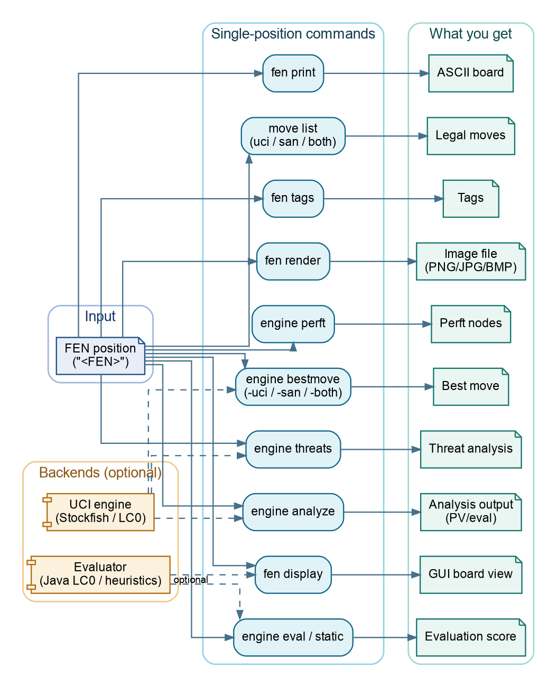

# ChessRTK (`crtk`)

ChessRTK is a Java 17 chess research toolkit for people who want reliable
chess primitives from the command line: FEN and SAN handling, legal move
generation, perft validation, engine analysis, puzzle mining, dataset export,
board rendering, and native PDF book publishing.

It is not trying to be a consumer chess app. It is a toolkit for building,
checking, mining, exporting, and publishing chess work with commands that are
explicit enough for terminals, scripts, CI, and AI-agent workflows.

[Website docs](docs/index.html) |
[PDF manual](docs/chessrtk-manual.pdf) |
[Markdown wiki](wiki/README.md) |
[Getting started](wiki/getting-started.md) |
[Use cases](wiki/use-cases.md) |
[Cheatsheet](wiki/command-cheatsheet.md) |
[Command reference](wiki/command-reference.md) |
[FAQ](wiki/faq.md) |
[Troubleshooting](wiki/troubleshooting.md)

## Why ChessRTK Exists

Chess tooling often starts as a collection of one-off scripts. ChessRTK keeps
the hard parts in one shared Java core so every workflow uses the same position
model:

- legal move generation, make/undo, attack detection, and perft counters
- FEN, SAN, UCI move conversion, Chess960 starts, and line application
- bounded built-in search plus optional external UCI engine analysis
- position tags, puzzle mining, record filtering, and dataset writers
- board images, diagram PDFs, puzzle books, and print-cover generation

That shared core matters because one mistake in castling rights, en-passant,
promotion, notation, or move legality can poison search, tags, datasets,
rendering, and book output.

## Quick Start

Requirements:

- Java 17+ JDK with `javac`
- Optional: a UCI engine such as Stockfish for external analysis
- Optional: local model files under `models/` for NNUE, LC0, and T5 workflows

Build without Maven or Gradle:

```bash
mkdir -p out
javac --release 17 -d out $(find src -name "*.java")
java -cp out application.Main help
```

Install the `crtk` launcher on Debian/Ubuntu-style systems:

```bash
./install.sh
crtk doctor
crtk help
crtk version
```

If the launcher is not installed, replace `crtk ...` with:

```bash
java -cp out application.Main ...
```

## First Useful Commands

Inspect the starting position:

```bash
crtk fen print --startpos
crtk move list --startpos --format both
crtk engine perft --startpos --depth 4 --threads 4
```

Work with one FEN:

```bash
crtk fen validate --fen "<FEN>"
crtk fen normalize --fen "<FEN>"
crtk fen validate --fen "<FEN>" --json
crtk move after --fen "<FEN>" e2e4
crtk move play --fen "<FEN>" "e4 e5 Nf3 Nc6"
```

Generate reusable position seeds:

```bash
crtk fen generate --output shards/ --files 2 --per-file 20 --chess960-files 1
crtk gen fens --output endgames/ --files 1 --per-file 100 --rook-endgame --rooks 2
crtk gen fens --output specials/ --files 1 --per-file 25 --en-passant --max-attempts 250000
```

Ask for a move:

```bash
crtk move list --fen "<FEN>" --jsonl
crtk engine bestmove --fen "<FEN>" --format both --max-duration 2s
crtk engine builtin --fen "<FEN>" --depth 3 --format summary
```

Run research-friendly batch checks:

```bash
crtk engine bestmove-batch --input positions.txt --max-duration 1s
crtk engine analyze-batch --input positions.txt --multipv 3 --jsonl
crtk engine benchmark --startpos --depth 5 --iterations 5
crtk position diff --fen "<FEN>" --other "<FEN>" --json
```

Check your local setup:

```bash
crtk doctor
crtk config validate
crtk engine uci-smoke --nodes 1 --max-duration 5s
```

## What You Can Do

| Goal | Start with |
| --- | --- |
| Validate, normalize, and print positions | `fen validate`, `fen normalize`, `fen print` |
| Generate random or filtered FEN shards | `fen generate`, `gen fens` |
| List and convert legal moves | `move list`, `move uci`, `move san`, `move both`, `move to-san`, `move to-uci` |
| Apply one move or a line | `move after`, `move play`, `fen after`, `fen line` |
| Compare positions | `position diff` |
| Verify move generation | `engine perft`, `engine perft-suite`, `engine benchmark` |
| Use an external UCI engine | `engine analyze`, `engine bestmove`, `engine analyze-batch`, `engine bestmove-batch`, `engine compare`, `engine threats`, `engine uci-smoke` |
| Search in-process | `engine builtin`, `engine java` |
| Evaluate positions | `engine static`, `engine eval` |
| Mine puzzle candidates | `puzzle mine`, `puzzle pgn` |
| Tag positions and puzzle lines | `fen tags`, `puzzle tags` |
| Generate text from tags | `fen text`, `puzzle text` |
| Merge, filter, and summarize records | `record files`, `record stats`, `record tag-stats`, `record analysis-delta` |
| Export ML datasets | `record dataset npy`, `record dataset lc0`, `record dataset classifier` |
| Publish diagrams and books | `book pdf`, `book render`, `book cover`, `book collection`, `book study` |
| Use a desktop workbench | `gui-workbench`, `workbench`, `gui`, `gui-web`, `gui-next` |

For the full command surface, run:

```bash
crtk help --full
```

or open [wiki/command-reference.md](wiki/command-reference.md).

## Example Workflows

### Verify The Chess Core

```bash
./scripts/run_regression_suite.sh core
crtk engine perft-suite --depth 6 --threads 4
crtk engine perft-suite --suite custom-perft.tsv --threads 4
```

`engine perft-suite` compares stored truth positions against ChessRTK's Java
move generator. It does not call Stockfish or any other external engine.

### Mine Puzzle Records

```bash
crtk fen pgn --input games.pgn --output seeds.txt
crtk puzzle mine \
  --input seeds.txt \
  --output dump/run.json \
  --engine-instances 4 \
  --max-duration 60s
crtk record stats --input dump/run.puzzles.json
crtk record export pgn --input dump/run.puzzles.json --output dump/run.puzzles.pgn
```

### Generate Filtered FEN Seeds

```bash
crtk gen fens \
  --output training/endgames \
  --files 4 \
  --per-file 500 \
  --endgame \
  --max-material-imbalance 300

crtk gen fens \
  --output training/rook-endgames \
  --files 2 \
  --per-file 250 \
  --rook-endgame \
  --rooks 2 \
  --max-attempts 500000

crtk gen fens \
  --output training/tactical-states \
  --files 1 \
  --per-file 100 \
  --promotion \
  --capture \
  --max-attempts 1000000
```

Filters combine with AND, so each generated FEN must satisfy every selected
condition.

### Export Training Data

```bash
crtk record dataset npy \
  --input dump/run.puzzles.json \
  --output training/puzzles

crtk record dataset lc0 \
  --input dump/run.puzzles.json \
  --output training/lc0/puzzles \
  --weights models/leela_112planes-10blocksx128-policyhead80-valuehead32-policy4672-wdl3.bin
```

### Publish A Puzzle Book

```bash
crtk book render -i books/puzzles.toml --check
crtk book render -i books/puzzles.toml -o dist/puzzles.pdf
crtk book cover -i books/puzzles.toml --check \
  --pdf dist/puzzles.pdf --binding paperback --interior white-bw
crtk book cover -i books/puzzles.toml -o dist/puzzles-cover.pdf \
  --pdf dist/puzzles.pdf --binding paperback --interior white-bw
```

ChessRTK writes native PDFs, so the publishing path does not require LaTeX.

## Architecture



ChessRTK is organized as a layered toolkit:

1. `chess.core` owns board state, legality, notation, Chess960, and perft.
2. `chess.engine`, `chess.eval`, and model packages add bounded search and
   evaluation.
3. `application.cli` exposes deterministic command contracts.
4. Record, dataset, rendering, GUI, and book layers reuse the same position
   model.
5. Optional UCI engines and local model weights extend analysis depth without
   replacing the Java core.

See [wiki/architecture.md](wiki/architecture.md) and
[wiki/development-notes.md](wiki/development-notes.md).

## Built-In Engine And Optional Engines

ChessRTK has two engine paths:

- External UCI engines for strength-sensitive analysis, MultiPV, threats, and
  long mining runs.
- `engine builtin`, a Java alpha-beta searcher for bounded in-process search,
  deterministic smoke tests, and machines with no external engine configured.

Examples:

```bash
crtk engine bestmove --fen "<FEN>" --format both --max-duration 5s
crtk engine builtin --fen "<FEN>" --depth 4 --nodes 100000 --format summary
crtk engine builtin --nnue --fen "<FEN>"
crtk engine builtin --lc0 --weights models/leela_112planes-10blocksx128-policyhead80-valuehead32-policy4672-wdl3.bin --fen "<FEN>"
```

More:

- [Configuration](wiki/configuration.md)
- [In-house Java engine](wiki/in-house-engine.md)
- [LC0 UCI engine and Java evaluator](wiki/lc0.md)

## Documentation

The browsable documentation site is generated under [docs/index.html](docs/index.html).
Open it directly in a browser, or publish the `docs/` directory with GitHub
Pages. The Markdown source lives under [wiki/](wiki/).

For offline reading or printing, use the generated
[PDF manual](docs/chessrtk-manual.pdf). Rebuild the site and manual with:

```bash
python3 scripts/build_manual_pdf.py
```

The wiki is organized like a project handbook:

- [Home](wiki/Home.md)
- [Getting started](wiki/getting-started.md)
- [Use cases](wiki/use-cases.md)
- [Command cheatsheet](wiki/command-cheatsheet.md)
- [FAQ](wiki/faq.md)
- [Architecture](wiki/architecture.md)
- [Quality and testing](wiki/quality-and-testing.md)
- [Command reference](wiki/command-reference.md)
- [Configuration](wiki/configuration.md)
- [Example commands](wiki/example-commands.md)
- [Mining puzzles](wiki/mining.md)
- [Filter DSL](wiki/filter-dsl.md)
- [Datasets](wiki/datasets.md)
- [Book publishing](wiki/book-publishing.md)
- [Piece and position tags](wiki/piece-tags.md)
- [Tag reference](wiki/tag-reference.md)
- [Outputs and logs](wiki/outputs-and-logs.md)
- [Development notes](wiki/development-notes.md)
- [Troubleshooting](wiki/troubleshooting.md)

## Regression Checks

Recommended local pass:

```bash
./scripts/run_regression_suite.sh recommended
```

Focused checks:

```bash
./scripts/run_regression_suite.sh build
./scripts/run_regression_suite.sh lint
./scripts/run_regression_suite.sh docs
./scripts/run_regression_suite.sh core
./scripts/run_regression_suite.sh cli
./scripts/run_regression_suite.sh engine
./scripts/run_regression_suite.sh uci
./scripts/run_regression_suite.sh book
./scripts/run_regression_suite.sh perft-smoke
```

After move-generation, FEN, SAN, Chess960, or make/undo changes, run a deeper
perft suite:

```bash
CRTK_PERFT_SUITE_DEPTH=6 CRTK_PERFT_THREADS=4 ./scripts/run_regression_suite.sh perft-smoke
```

## License

ChessRTK is licensed under the GNU General Public License, version 3. See
[LICENSE.txt](LICENSE.txt).

If you use ChessRTK in research or published workflows, cite the repository and
pin a commit hash or tag so the run can be reproduced.
