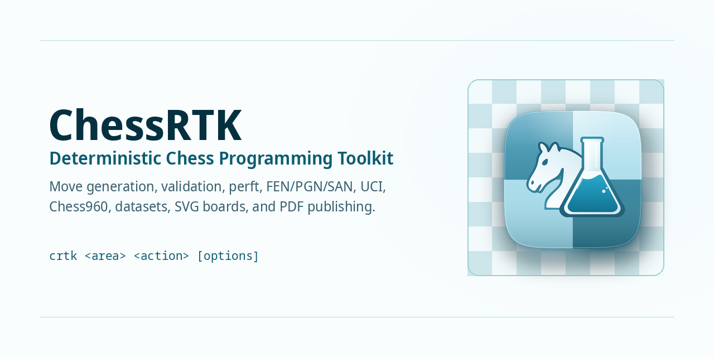

# ChessRTK Wiki



ChessRTK (`crtk`) is a Java 17 chess research toolkit for deterministic chess
workflows: FEN and SAN handling, legal move generation, perft validation,
engine analysis, puzzle mining, dataset export, board rendering, and native PDF
book publishing.

The project is organized around one shared position model. That means the same
rules implementation drives command-line move lists, built-in search, UCI
analysis, tags, datasets, diagrams, GUI views, and book output.

## Pick Your Path

| If you want to... | Read this | Then run |
| --- | --- | --- |
| Install and verify ChessRTK | [Getting Started](getting-started) | `crtk doctor` |
| Choose the right workflow | [Use Cases](use-cases) | start with the row that matches your job |
| Copy useful recipes | [Command Cheatsheet](command-cheatsheet) | `crtk move list --startpos --format both` |
| Learn the command shape | [Command Reference](command-reference) | `crtk help --full` |
| Configure Stockfish or LC0 | [Configuration](configuration) | `crtk engine uci-smoke --nodes 1` |
| Mine tactical data | [Mining Puzzles](mining) | `crtk puzzle mine --random-count 50 --output dump/` |
| Export training tensors | [Datasets](datasets) | `crtk record dataset npy -i dump/run.puzzles.json -o training/run` |
| Publish diagrams or books | [Book Publishing](book-publishing) | `crtk book render -i books/puzzles.toml --check` |
| Automate with stable outputs | [AI Agents and Automation](ai-agents) | `crtk move both --fen "<FEN>"` |
| Check quality before pushing | [Quality and Testing](quality-and-testing) | `./scripts/run_regression_suite.sh recommended` |
| Diagnose a failure | [Troubleshooting](troubleshooting) | start with the matching failure section |

## Copy-Paste Smoke Test

```bash
crtk doctor
crtk fen print --startpos
crtk move list --startpos --format both
crtk engine perft --startpos --depth 4 --threads 4
crtk engine builtin --startpos --depth 3 --format summary
```

If the launcher is not installed, use:

```bash
java -cp out application.Main <area> <action> [options]
```

## The Three Documentation Surfaces

| Surface | Best for | Link |
| --- | --- | --- |
| GitHub Wiki | browsing project knowledge inside GitHub | this wiki |
| GitHub Pages site | website-style docs with a custom layout | [LenniAConrad.github.io/chess-rtk](https://LenniAConrad.github.io/chess-rtk/) |
| CLI help | exact installed command options | `crtk help --full` |

## What ChessRTK Covers

| Area | Main commands | Notes |
| --- | --- | --- |
| Position handling | `fen validate`, `fen normalize`, `fen print`, `fen chess960` | Runs in-process; no UCI engine needed |
| Move primitives | `move list`, `move to-san`, `move to-uci`, `move after`, `move play` | Stable outputs for scripts and agents |
| Move generation checks | `engine perft`, `engine perft-suite` | Uses stored truth positions, not Stockfish |
| Engine analysis | `engine analyze`, `engine bestmove`, `engine threats` | Uses configured UCI engines |
| Built-in search | `engine builtin`, `engine java` | Java alpha-beta fallback and benchmark target |
| Records and filters | `record files`, `record stats`, `record analysis-delta` | Reusable analysis dumps |
| Dataset export | `record dataset npy`, `record dataset lc0`, `record dataset classifier` | Writes portable files directly |
| Publishing | `book pdf`, `book render`, `book cover` | Native PDFs, no LaTeX required |

## Most Common Workflows

### Study One Position

```bash
crtk fen print --fen "<FEN>"
crtk move list --fen "<FEN>" --format both
crtk engine bestmove --fen "<FEN>" --format both --max-duration 2s
```

### Validate The Core

```bash
./scripts/run_regression_suite.sh core
crtk engine perft-suite --depth 6 --threads 4
```

### Mine And Export Puzzles

```bash
crtk fen pgn --input games.pgn --output seeds.txt
crtk puzzle mine --input seeds.txt --output dump/run.json --engine-instances 4
crtk record export pgn --input dump/run.puzzles.json --output dump/run.pgn
```

## Architecture At A Glance


The main design rule is simple: avoid separate chess implementations for
separate tools. FEN parsing, SAN conversion, legality, make/undo, perft,
search, rendering, tagging, and export paths all meet at the same Java core.

## Core Documentation

| Section | Pages |
| --- | --- |
| User setup | [Getting Started](getting-started), [Build & Install](build-and-install), [Configuration](configuration), [FAQ](faq), [Troubleshooting](troubleshooting) |
| Commands | [Command Cheatsheet](command-cheatsheet), [Command Reference](command-reference), [Example Commands](example-commands) |
| Workflows | [Mining Puzzles](mining), [Filter DSL](filter-dsl), [Datasets](datasets), [Book Publishing](book-publishing), [Tags](piece-tags) |
| Engines | [In-House Engine](in-house-engine), [LC0](lc0), [T5 Text](t5) |
| Developers | [Architecture](architecture), [Quality and Testing](quality-and-testing), [Development Notes](development-notes), [Releasing](releasing), [Roadmap](roadmap), [Glossary](glossary) |

## Website Version

GitHub Wiki pages use GitHub's built-in Markdown renderer. For the website-style
version with the custom sidebar, page table of contents, and generated HTML
layout, use:

```text
https://LenniAConrad.github.io/chess-rtk/
```

## Support

Start with [Troubleshooting](troubleshooting). If you are reporting a bug,
include the exact command, input FEN or file, Java version, operating system,
engine protocol TOML if relevant, and whether this passes:

```bash
./scripts/run_regression_suite.sh recommended
```
