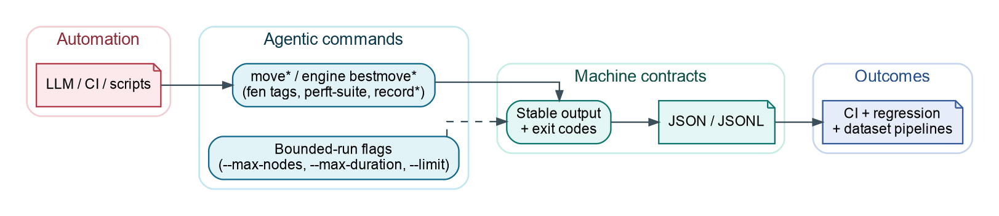

# AI Agents and Automation

ChessRTK exposes deterministic chess primitives that work well in CI, scripts,
and LLM tool workflows. The safest pattern is to use the narrowest command for
the task: move conversion for notation, FEN commands for position validity,
perft commands for move-generation checks, and bounded engine commands for
analysis.

These commands are worth using because they are built on the same correctness
surface as the rest of the toolkit: one shared position model, deterministic
output shapes, and regression-backed move-generation checks instead of ad hoc
string parsing or GUI scraping.



Diagram source: `assets/diagrams/crtk-agentic-commands.dot`.

## Why Agents Can Trust This

- Machine-oriented commands prefer line-based formats, explicit flags, stable
  exit codes, and bounded search budgets.
- Core move generation is validated against stored perft truth positions and
  detailed counters, so legality-sensitive workflows do not depend on an
  external engine.
- The same core is reused for notation conversion, line application, perft
  checks, builtin search, exporters, and higher-level automation workflows.
- `./scripts/run_regression_suite.sh core` and
  `./scripts/run_regression_suite.sh recommended` provide repeatable regression
  entry points before longer CI or agent runs.

## Quick Verification

Before using the commands in longer automated runs, a fast smoke pass is:

```bash
mkdir -p out
javac --release 17 -d out $(find src -name "*.java")
java -cp out testing.CoreMoveGenerationRegressionTest
java -cp out application.Main move list --format both --fen "rnbqkbnr/pppppppp/8/8/8/8/PPPPPPPP/RNBQKBNR w KQkq - 0 1"
```

## Command Contracts

| Need | Command shape | Output contract |
| --- | --- | --- |
| Legal moves | `move list --format uci|san|both` | one move per line, deterministic order |
| UCI move list | `move uci --fen "<FEN>"` | one UCI move per line |
| SAN move list | `move san --fen "<FEN>"` | one SAN move per line |
| UCI and SAN together | `move both --fen "<FEN>"` | `uci<TAB>san` per line |
| Convert one move | `move to-san`, `move to-uci` | one converted move |
| Apply one move | `move after --fen "<FEN>" <move>` | resulting FEN |
| Apply a line | `move play --fen "<FEN>" <moves...>` | final FEN, or every FEN with `--intermediate` |
| Validate FEN | `fen validate --fen "<FEN>"` | `valid<TAB><normalized-fen>` on success |
| Normalize FEN | `fen normalize --fen "<FEN>"` | normalized FEN |
| Chess960 starts | `fen chess960 <index>` | deterministic Scharnagl-indexed FEN |
| Best move | `engine bestmove --format uci|san|both` | one best move row |
| Built-in fallback search | `engine builtin --format uci|san|both|summary` | bounded in-process search output |
| Static evaluation | `engine static`, `engine eval` | one evaluation per input position |
| Movegen counters | `engine perft` | nodes and detailed counters |
| Movegen regression | `engine perft-suite` | progress bar, then truth/calculated table |
| Setup health | `doctor`, `config validate`, `engine uci-smoke` | diagnostics and process exit status |

## Recommended Agent Workflow

1. Run `crtk doctor` and `crtk config validate` before long jobs.
2. Normalize input FENs with `fen normalize`.
3. Use `move list --format both` to expose legal moves with both UCI and SAN.
4. Use `move after` or `move play` to advance positions instead of editing FENs.
5. Use `engine bestmove --format both` when a configured UCI engine is
   available.
6. Use `engine builtin --format summary` when in-process bounded search is
   preferable.
7. Run `engine perft-suite --depth 6 --threads <n>` after core move-generation
   changes.

## Deterministic Move Tasks

List legal moves:

```bash
crtk move list --fen "<FEN>" --format both
```

Convert moves:

```bash
crtk move to-san --fen "<FEN>" e2e4
crtk move to-uci --fen "<FEN>" Nf3
```

Apply a SAN or UCI line:

```bash
crtk move play --fen "<FEN>" "e4 e5 Nf3 Nc6"
crtk move play --fen "<FEN>" e2e4 e7e5 g1f3 --intermediate
```

These commands are better for automation than parsing board diagrams because
they have compact, line-oriented output.

## Engine Tasks

External UCI engine:

```bash
crtk engine bestmove --fen "<FEN>" --format both --max-duration 5s
crtk engine analyze --fen "<FEN>" --multipv 3 --max-nodes 1000000
crtk engine threats --fen "<FEN>" --max-duration 2s
```

Built-in Java engine:

```bash
crtk engine builtin --fen "<FEN>" --depth 4 --format summary
crtk engine builtin --fen "<FEN>" --nodes 100000 --max-duration 500ms --format uci
```

For UCI engine commands, use explicit `--nodes`, `--max-duration`, `--threads`,
and `--hash` values when you need reproducible behavior. For the built-in
engine, use `--depth`, `--nodes`, `--max-duration`, and the evaluator flags;
it does not spawn an engine process or accept UCI `--threads`/`--hash` options.

## Move-Generation Checks

Single-position counters:

```bash
crtk engine perft --fen "<FEN>" --depth 5
crtk engine perft --randompos --depth 4
crtk engine perft --fen "<FEN>" --depth 5 --divide --threads 4
crtk engine perft --fen "<FEN>" --depth 5 --format stockfish --threads 4
```

Regression suite:

```bash
crtk engine perft-suite --depth 6 --threads 4
```

The suite prints a progress bar while positions run. After the progress bar
finishes, it prints a table with `No`, `Depth`, `FEN`, `Truth`, `Calculated`,
`Speed`, and `Match`.

## Record and Dataset Plumbing

Agents can keep data transformations explicit:

```bash
crtk record files -i dump/ -o dump/merged.json --recursive --puzzles
crtk record stats -i dump/merged.json
crtk record tag-stats -i dump/merged.json
crtk record analysis-delta -i dump/merged.json -o dump/merged.analysis-delta.jsonl
```

Dataset exports:

```bash
crtk record dataset npy -i dump/merged.json -o training/npy/merged
crtk record dataset classifier -i dump/puzzles.json -i dump/nonpuzzles.json -o training/classifier/run
crtk record export training-jsonl -i dump/puzzles.json -i dump/nonpuzzles.json -o training/run.jsonl
```

## Practical Rules

- Prefer `--format uci|san|both|summary` flags over parsing prose.
- Prefer FEN and UCI/SAN commands over GUI or image output for agent decisions.
- Put engine budgets on every automated analysis command.
- Keep `--verbose` off in normal pipelines and enable it only for failures.
- Treat `doctor --strict`, `config validate`, and `engine uci-smoke` as setup
  gates for CI jobs.
