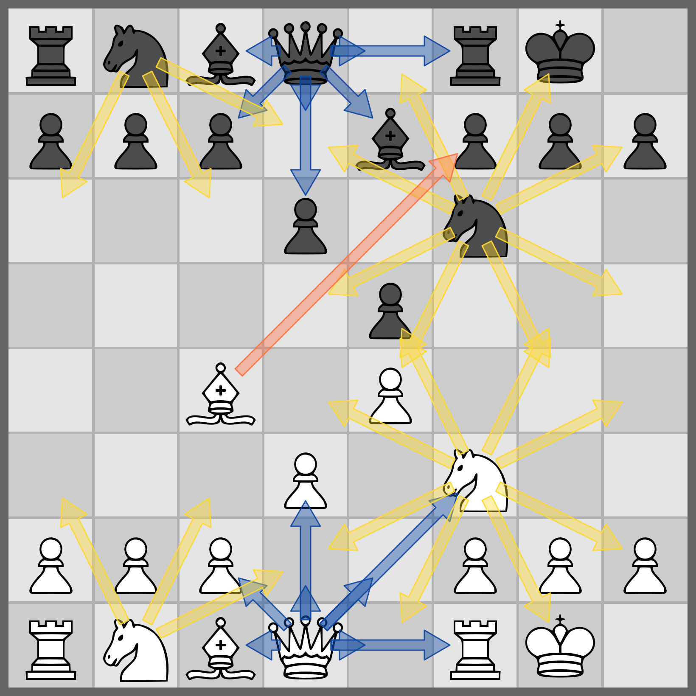

# Command reference

One command-line interface drives every feature of ChessRTK ("crtk"), and one chess core sits underneath all of it. A FEN that validates in `fen validate` parses the same way in `move list`, `engine perft`, the workbench, and every dataset exporter — same parser, same move generator, same notation, so the same input always yields the same output. This page lists every area, subcommand, and option, grouped so you can find a command, copy its example, and trust the result to reproduce on the next machine.

Invocations follow `crtk <area> <action> [options] [args]`. From a build tree rather than the installed launcher, that becomes `java -jar crtk.jar <area> <action> ...` or `java -cp out application.Main <area> <action> ...`. For anything this page leaves vague, `crtk help --full` prints the authoritative spec, and per-command help is either `crtk help <area> <action>` or `crtk <area> <action> --help`.

## Command style and global conventions

The grammar is noun-verb: an *area* (the noun, such as `engine` or `record`) followed by an *action* (the verb, such as `bestmove` or `export`). A few areas add a second noun level, as in `record export plain` or `record dataset npy`. In scripts, spell out the full grouped form — it survives renames and reads clearly six months later.

- Structured values go through named flags. `--fen`, `--input`/`-i`, `--output`/`-o`, and `--format` mean the same thing everywhere they appear.
- When scripting, put options before free-form positional args, and guard anything that could be mistaken for a flag — a FEN, a SAN move, a negative number — with a leading `--`.
- Position commands take the FEN positionally or via `--fen`; `--startpos` gives the standard start, `--randompos` a reachable random legal position.
- `--verbose`/`-v` turns a failure into a full stack trace on nearly every command. The lists below leave it out unless it is the only option worth mentioning.
- Row-oriented commands share `--json`, `--jsonl`, `--no-header`, and `--quiet`.
- Engine-backed commands share one option block: `--protocol-path`/`-P`, `--max-nodes`/`--nodes`, `--max-duration`, `--multipv`, `--threads`, `--hash`, and `--wdl`/`--no-wdl`.

Most of the surface never touches an external engine. The in-process commands (`fen`, `move`, `position`, `engine benchmark`, `engine perft`, `engine perft-suite`, `engine mate`, `engine builtin`, `engine java`, `engine static`) run start to finish inside the JVM. A configured UCI engine is required only for the workflows that delegate search: `engine analyze`, the `engine bestmove*` family, `engine analyze-batch`, `engine bestmove-batch`, `engine compare`, `engine threats`, `engine uci-smoke`, the `--analyze` tagging paths, and `puzzle mine`.

## Areas at a glance

| Area | Purpose |
| --- | --- |
| `record` | Export, filter, split, and summarize `.record` files; build training datasets |
| `fen` | Validate, normalize, generate, transform, and render FENs |
| `gen` | Generate reusable data seeds and artifacts (alias surface) |
| `batch` | Run multiple ChessRTK CLI commands from one script |
| `move` | List, convert, and apply moves |
| `engine` | Analyze, evaluate, search, prove mates, and validate move generation |
| `mate` | Brute-force prove a forced mate without NN evaluation (shortcut for `engine mate`) |
| `position` | Inspect and compare positions |
| `book` | Render chess books, covers, studies, and diagram PDFs |
| `puzzle` | Mine, convert, tag, and summarize puzzle lines |
| `config` | Show and validate configuration |
| `workbench` | Launch the native command and analysis workbench (alias `gui`) |
| `doctor` | Check Java, config, protocol, engine, and local artifacts |
| `clean` | Delete session cache and logs |
| `help` | Show command help |
| `version` | Print ChessRTK version metadata |

## record

A `.record` file is the canonical container for analyzed positions, puzzle trees, and engine PVs — JSON, or JSONL when you want streaming. Everything that produces analysis writes records; the `record` area is how you get them back out. It exports rows to text and tensor formats, merges, filters, and splits files, and summarizes what they hold. Spell out the grouped forms (`record export ...`, `record dataset ...`) in scripts.

| Subcommand | Purpose |
| --- | --- |
| `record export plain` | Convert `.record` JSON to Leela-style `.plain` blocks |
| `record export csv` | Convert `.record` JSON to CSV |
| `record export pgn` | Convert `.record` JSON to PGN games |
| `record export puzzle-jsonl` | Export verified puzzle rows as JSONL with LC0 policy values |
| `record export puzzle-elo-jsonl` | Export verified puzzle records with Elo and position tags |
| `record export training-jsonl` | Export coarse/fine FEN labels for training |
| `record dataset npy` | Export NumPy evaluation-regression tensors |
| `record dataset lc0` | Export LC0-style policy/value tensors |
| `record dataset classifier` | Export one-logit binary classifier tensors |
| `record files` | Merge, filter, or split record files |
| `record stats` | Summarize record files |
| `record tag-stats` | Summarize tag distributions |
| `record analysis-delta` | Compare parent/child analysis changes |

### record export plain

Convert a `.record` JSON array into Leela-style `.plain` blocks (mainline only by default).

| Option | Description |
| --- | --- |
| `--input`/`-i PATH` | Input `.record` JSON file (required) |
| `--output`/`-o PATH` | Output `.plain` file (default `dump/<input-stem>.plain`) |
| `--export-all` / `--sidelines` | Include all sidelines (default: mainline only) |
| `--filter`/`-f DSL` | Filter DSL to select which records are exported |
| `--csv` | Also emit a CSV export |
| `--csv-output`/`-C PATH` | Explicit CSV output path (default `dump/<input-stem>.csv`; also enables CSV) |

```bash
crtk record export plain --input dump/run.record --output dump/run.plain --sidelines
```

### record export csv

Convert a `.record` JSON array directly to CSV (no `.plain` output).

| Option | Description |
| --- | --- |
| `--input`/`-i PATH` | Input `.record` JSON file (required) |
| `--output`/`-o PATH` | Output CSV file (default `dump/<input-stem>.csv`) |
| `--filter`/`-f DSL` | Filter DSL to select which records are exported |

```bash
crtk record export csv --input dump/run.record --filter "puzzle:true"
```

### record export pgn

Convert a `.record` JSON array into one or more PGN games.

| Option | Description |
| --- | --- |
| `--input`/`-i PATH` | Input `.record` JSON file (required) |
| `--output`/`-o PATH` | Output PGN file (default `dump/<input-stem>.pgn`) |

```bash
crtk record export pgn --input dump/run.record --output dump/run.pgn
```

### record export puzzle-jsonl

Export `.record` rows as puzzle JSONL annotated with LC0 policy values. The policy map comes from the network, so this one needs ChessRTK LC0 CNN `.bin` weights.

| Option | Description |
| --- | --- |
| `--input`/`-i PATH` | Input `.record` JSON file (required) |
| `--output`/`-o PATH` | Output JSONL file (default `dump/<input-stem>.puzzle.jsonl`) |
| `--weights PATH` | ChessRTK LC0 CNN `.bin` weights path (required) |
| `--filter`/`-f DSL` | Optional row-selection Filter DSL |
| `--puzzles` | Keep only puzzle records |
| `--nonpuzzles` | Keep only non-puzzle records |

```bash
crtk record export puzzle-jsonl --input dump/run.record --weights models/leela.bin --puzzles
```

### record export puzzle-elo-jsonl

Export verified puzzle records as JSONL with Elo-style difficulty tags. By default it scores the puzzle trees in-process; if you already have a scored ratings CSV, point at it with `--ratings-csv` and the export skips straight to a single pass. Takes multiple inputs and directories.

| Option | Description |
| --- | --- |
| `--input`/`-i PATH` | Input record file(s) or directories (repeatable; required) |
| `--output`/`-o PATH` | Output JSONL file (default `dump/<input-stem>.puzzle-elo.jsonl`) |
| `--recursive` | Recurse into input directories |
| `--max-records N` | Score at most `N` verified puzzles (`0`/default: no cap) |
| `--threads N` | Tree-scoring worker threads (default: available processors) |
| `--ratings-csv PATH` | Reuse an existing scored rating CSV for a one-pass re-export |

```bash
crtk record export puzzle-elo-jsonl --input dump/puzzles/ --recursive --threads 8
```

### record export training-jsonl

Flatten one or more record files into one-position-per-line training JSONL. Labels fall into three tiers: a row matching the puzzle DSL gets `coarse_label=1`/`fine_label=2`; a row that shares a parent FEN with a puzzle gets `coarse_label=1`/`fine_label=1`; everything else gets `coarse_label=0`/`fine_label=0`. Engine metadata never reaches the model — it stays out of the feature columns by design.

| Option | Description |
| --- | --- |
| `--input`/`-i PATH` | Input record file(s) or directories (repeatable; required) |
| `--output`/`-o PATH` | Output JSONL file (default `dump/<input-stem>.training.jsonl`) |
| `--filter`/`-f DSL` | Puzzle Filter DSL; matching rows become `verified_puzzle` |
| `--recursive` | Recurse into input directories |
| `--include-engine-metadata` | Retain engine/PV details as metadata only |
| `--max-records N` | Stop after writing `N` rows (`0`/default: no cap) |

```bash
crtk record export training-jsonl --input dump/run.record --output dump/train.jsonl
```

### record dataset npy

Convert a `.record` JSON array into NumPy tensors: `<stem>.features.npy` shaped `(N, 781)` float32 and `<stem>.labels.npy` shaped `(N,)` float32 (pawns).

| Option | Description |
| --- | --- |
| `--input`/`-i PATH` | Input `.record` JSON file (required) |
| `--output`/`-o PATH` | Output dataset prefix (default `dump/<input-stem>.dataset`) |

```bash
crtk record dataset npy --input dump/run.record --output dump/run.dataset
```

### record dataset lc0

Convert a `.record` JSON array into LC0-style tensors: `<stem>.lc0.inputs.npy` `(N, 112*64)`, `<stem>.lc0.policy.npy` `(N, policySize)` one-hot, `<stem>.lc0.value.npy` `(N,)` in `[-1,1]`, plus `<stem>.lc0.meta.json`.

| Option | Description |
| --- | --- |
| `--input`/`-i PATH` | Input `.record` JSON file (required) |
| `--output`/`-o PATH` | Output dataset prefix (default `dump/<input-stem>.lc0`) |
| `--weights PATH` | Optional LC0 weights to compress the policy to the net's size |

```bash
crtk record dataset lc0 --input dump/run.record --weights models/leela.bin
```

### record dataset classifier

Convert one or more record files into tensors for the one-logit binary classifier: `<stem>.classifier.inputs.npy` `(N, 21*64)`, `<stem>.classifier.labels.npy` `(N,)` (`0.0` negative, `1.0` positive), plus `<stem>.classifier.meta.json`. Labeling without `--label-filter` follows whatever the records carry: an explicit `kind:"puzzle"`/`kind:"nonpuzzle"` wins if present, and the configured puzzle verification filter decides the rest.

| Option | Description |
| --- | --- |
| `--input`/`-i PATH` | Input record file(s) or directories (repeatable; required) |
| `--output`/`-o PATH` | Output dataset prefix (default `dump/<input-stem>.classifier`; required for multiple inputs) |
| `--filter`/`-f DSL` | Optional row-selection Filter DSL applied before labeling |
| `--label-filter DSL` | Optional positive-label Filter DSL (overrides kind) |
| `--max-positives N` | Cap positive rows |
| `--max-negatives N` | Cap negative rows |
| `--recursive` | Recurse into input directories |

```bash
crtk record dataset classifier --input dump/records/ --recursive --label-filter "puzzle:true"
```

### record files

Merge, filter, and split record files.

| Option | Description |
| --- | --- |
| `--input`/`-i PATH` | Input record file(s) or directories (repeatable; positionals allowed) |
| `--output`/`-o PATH` | Output record file or directory (required) |
| `--filter`/`-f DSL` | Filter DSL to select records |
| `--puzzles` | Keep only puzzle records |
| `--nonpuzzles` | Keep only non-puzzle records |
| `--max-records N` | Split output into parts with at most `N` records each |
| `--recursive` | Recurse into input directories |

```bash
crtk record files --input dump/shards/ --recursive --output dump/merged.record --max-records 10000
```

### record stats

Summarize a `.record` or puzzle JSON/JSONL dump (counts, top tags, top engines).

| Option | Description |
| --- | --- |
| `--input`/`-i PATH` | Input JSON array/JSONL file (required) |
| `--top N` | Number of top tags/engines to show (default `10`) |

```bash
crtk record stats --input dump/run.record --top 20
```

### record tag-stats

Summarize tag distributions in a dump.

| Option | Description |
| --- | --- |
| `--input`/`-i PATH` | Input JSON array/JSONL file (required) |
| `--top N` | Number of top tags to show (default `20`) |

```bash
crtk record tag-stats --input dump/run.record --top 30
```

### record analysis-delta

Export one JSONL row per record with evaluation-stability metrics: initial and final eval, delta type/value, fluctuation range, and time/depth to final value.

| Option | Description |
| --- | --- |
| `--input`/`-i PATH` | Input record file (required) |
| `--output`/`-o PATH` | Output JSONL path (default `dump/<input-stem>.analysis-delta.jsonl`) |

```bash
crtk record analysis-delta --input dump/run.record
```

## fen

Everything that begins with a FEN lives here: validation, normalization, generation, PGN conversion, Chess960 enumeration, board rendering, tagging, and text. They all share the same core, so a FEN normalized here is byte-for-byte the FEN every other command expects.

| Subcommand | Purpose |
| --- | --- |
| `fen validate` | Validate a FEN |
| `fen normalize` | Normalize and validate a FEN |
| `fen after` | Apply one move and print the resulting FEN (alias of `move after`) |
| `fen line` | Apply a move line and print the resulting FEN (alias of `move play`; `fen play` also works) |
| `fen generate` | Generate random legal FEN shards |
| `fen pgn` | Convert PGN games to FEN lists |
| `fen chess960` | Print Chess960 starting positions by index or range |
| `fen print` | Pretty-print a position as ASCII |
| `fen display` | Render a position in a window |
| `fen render` | Save a position image to disk |
| `fen relations` | Render the OTIS tactical-incidence relation channels as typed arrows |
| `fen tags` | Generate tags for FENs, PGNs, or variations |
| `fen text` | Summarize position tags with T5 |

### fen validate

Validate a FEN; prints `valid<TAB><normalized-fen>` on success.

| Option | Description |
| --- | --- |
| `--fen FEN` | FEN to validate (or pass positionally) |
| `--startpos` / `--randompos` | Use the standard start / a random legal position |
| `--stdin` | Read one FEN per non-blank stdin line |
| `--json` | Emit one JSON object, or an array for multiple rows |
| `--jsonl` | Emit one JSON object per row |
| `--no-header` / `--quiet` | Script-friendly output toggles |

```bash
crtk fen validate "rnbqkbnr/pppppppp/8/8/8/8/PPPPPPPP/RNBQKBNR w KQkq - 0 1"
```

### fen normalize

Parse a FEN and print it back in the canonical form the core uses internally — useful when two FENs should be equal but a stray castling-rights or move-counter difference says otherwise. Same I/O options as `fen validate`.

| Option | Description |
| --- | --- |
| `--fen FEN` | FEN to normalize (or pass positionally) |
| `--startpos` / `--randompos` | Use the standard start / a random legal position |
| `--stdin` | Read one FEN per non-blank stdin line |
| `--json` | Emit one JSON object, or an array for multiple rows |
| `--jsonl` | Emit one JSON object per row |
| `--no-header` / `--quiet` | Script-friendly output toggles |

```bash
crtk fen normalize --stdin < positions.txt
```

### fen after / fen line

`fen after` is an alias for `move after`, and `fen line` (also `fen play`) is an alias for `move play`. See [move after](#move-after) and [move play](#move-play) for the full option set.

```bash
crtk fen after --fen "<FEN>" e2e4
crtk fen line --fen "<FEN>" "e4 e5 Nf3 Nc6"
```

### fen generate

Write random legal FEN shards to disk, mixing standard and Chess960 starts. Filters stack with AND — every condition you name has to hold, so a tight combination can reject most candidates and lean on `--max-attempts`. `gen fens` is an alias for this command.

| Option | Description |
| --- | --- |
| `--output`/`-o PATH` | Output directory (default `dump/all_positions_shards`) |
| `--files N` | Number of shard files to write |
| `--per-file N` | FENs per shard file |
| `--batch N` | Positions per RNG batch |
| `--chess960-files N` | How many of the first shard files are seeded from Chess960 starts |
| `--max-attempts N` | Candidate cap per shard when filters are selective |
| `--ascii` | Use an ASCII progress bar |

Stage presets: `--stage NAME` (`endgame`, `late-endgame`, `king-pawn`, `minor`, `rook`, `queenless`), `--endgame`, `--late-endgame`, `--king-pawn-endgame`, `--minor-endgame`, `--rook-endgame`, `--queenless`, `--opposite-bishops`.

Move-state filters: `--side white|black|w|b`, `--in-check`, `--not-in-check`, `--checkmate`, `--stalemate`, `--en-passant`/`--ep`, `--promotion`, `--underpromotion`, `--capture`, `--castle-rights`, `--legal-castle`.

Count and material filters (each supports an exact value plus `--min-*`/`--max-*` forms): `--pieces N`, `--white-pieces N`, `--black-pieces N`, `--pawns`/`--knights`/`--bishops`/`--rooks`/`--queens N`, side-specific forms such as `--white-rooks N`/`--black-rooks N`, `--material N`, `--material-diff N` (White minus Black, cp), `--max-material-imbalance N` (max absolute difference, cp), `--legal-moves N`, `--fullmove N`, `--halfmove N`.

```bash
crtk fen generate --output shards/ --files 2 --per-file 20 --chess960-files 1
crtk gen fens --output rook-endgames/ --files 1 --per-file 200 --rook-endgame --rooks 2
crtk gen fens --output specials/ --files 1 --per-file 25 --en-passant --max-attempts 250000
```

### fen pgn

Convert PGN games into a FEN list (usable as seeds).

| Option | Description |
| --- | --- |
| `--input`/`-i PATH` | Input PGN file (required) |
| `--output`/`-o PATH` | Output FEN list (default `dump/<input-stem>.txt`) |
| `--mainline` | Only output mainline positions |
| `--pairs` | Output `parent child` FEN pairs per line |

```bash
crtk fen pgn --input games.pgn --mainline --output positions.txt
```

### fen chess960

Print Chess960 starting positions in Scharnagl index order.

| Option | Description |
| --- | --- |
| `--index N` | Print one position by Scharnagl index (positional `N` is shorthand) |
| `--random` | Print one random position |
| `--count N` | Number of random positions with `--random` |
| `--all` | Print all 960 positions in index order |
| `--format FORMAT` | `fen` (default), `layout` (white back-rank only), or `both` (`index<TAB>layout<TAB>fen`) |

```bash
crtk fen chess960 518
crtk fen chess960 --random --count 5 --format both
```

### fen print

Pretty-print a FEN as ASCII (board, metadata, and tags).

| Option | Description |
| --- | --- |
| `--fen FEN` | FEN to render (or pass positionally) |
| `--startpos` / `--randompos` | Use the standard start / a random legal position |

```bash
crtk fen print --fen "<FEN>"
```

### fen display

Render a board image in a window, with optional overlays and theming.

| Option | Description |
| --- | --- |
| `--fen FEN` | FEN to render (or pass positionally) |
| `--startpos` / `--randompos` | Use the standard start / a random legal position |
| `--backend B` | Renderer backend (default: best available) |
| `--show-backend` | Print renderer backend info |
| `--flip` / `--black-down` | Render from Black's perspective / Black at the bottom |
| `--size N` | Window size (pixels) |
| `--width N` / `--height N` | Override window width / height |
| `--zoom Z` | Zoom factor (default `1`) |
| `--dark` / `--dark-mode` | Use dark theme |
| `--accent HEX` | Tint squares/grid/frame with a hex color (e.g. `#4ab66f`) |
| `--arrow`/`--arrows MOVES` | Draw arrow overlays (comma-separated squares) |
| `--special-arrows` | Draw special (castle/en-passant) arrow overlays |
| `--circle`/`--circles SQUARES` | Draw circle overlays |
| `--legal SQUARE` | Overlay legal move dots from a square |
| `--coordinates` / `--coordinates-outside` | Draw file/rank labels inside the border / in an outer margin (aliases: `--details-inside` / `--details-outside`) |
| `--ablation` | Overlay evaluator ablation heatmap |

```bash
crtk fen display --fen "<FEN>" --arrows e2e4,g1f3 --dark
```

### fen render

Save a board image to disk (PNG/JPG/BMP/SVG). Shares most overlay and theming options with `fen display`.

| Option | Description |
| --- | --- |
| `--fen FEN` | FEN to render (or pass positionally) |
| `--startpos` / `--randompos` | Use the standard start / a random legal position |
| `--output`/`-o PATH` | Output image/SVG path |
| `--format FORMAT` | `png`, `jpg`, `bmp`, or `svg` |
| `--backend B` / `--show-backend` | Renderer backend / print backend info |
| `--flip` / `--black-down` | Render from Black's perspective / Black at the bottom |
| `--size N` | Board size (pixels) |
| `--width N` / `--height N` | Override image width / height |
| `--zoom Z` | Zoom factor (default `1`) |
| `--dark` / `--dark-mode` | Use dark theme |
| `--accent HEX` | Tint squares/grid/frame with a hex color |
| `--drop-shadow` / `--shadow` | Add a subtle drop shadow |
| `--no-border` | Hide the outer border |
| `--arrow`/`--arrows MOVES` | Draw arrow overlays |
| `--special-arrows` | Draw special arrow overlays |
| `--circle`/`--circles SQUARES` | Draw circle overlays |
| `--legal SQUARE` | Overlay legal move dots from a square |
| `--coordinates` / `--coordinates-outside` | Draw file/rank labels inside the border / in an outer margin (aliases: `--details-inside` / `--details-outside`) |
| `--ablation` | Overlay evaluator ablation heatmap |

```bash
crtk fen render --fen "<FEN>" --output board.svg --size 800 --accent "#4ab66f"
```

### fen relations

Render the position as a *tactical-incidence graph*: typed, colour-coded arrows for each of the twelve relation channels the OTIS (oriented tactical-sheaf) network ingests. The edges come straight from the network's incidence builder, so the picture matches the model's input — and they are computed deterministically from the position alone, with no engine evaluation or model file.



*Knight attacks (yellow), occlusion-aware queen rays (blue), and the absolute pin `Bc4 → f7` against the castled king (coral), drawn with `fen relations`.*

The twelve channels (`--channel`/`--channels` accept the name, an index `0..11`, or `all`):

| # | Channel | Edges |
| --- | --- | --- |
| 0 | `us_attacks_them_piece` | side-to-move pieces attacking enemy pieces |
| 1 | `them_attacks_us_piece` | enemy pieces attacking ours |
| 2 | `us_defends_us_piece` | our pieces defending ours |
| 3 | `them_defends_them_piece` | enemy pieces defending theirs |
| 4 | `us_attacks_empty_near_king` | our pressure on empty squares in the enemy king zone |
| 5 | `them_attacks_empty_near_king` | enemy pressure on our king zone |
| 6 | `bishop_ray_visible` | visible bishop rays (stop at the first blocker) |
| 7 | `rook_ray_visible` | visible rook rays |
| 8 | `queen_ray_visible` | visible queen rays |
| 9 | `knight_attack` | knight attacks |
| 10 | `pawn_attack_forward_oriented` | pawn attacks (side-to-move oriented) |
| 11 | `king_ray_pin_candidate` | absolute-pin lines (pinner → pinned) |

| Option | Description |
| --- | --- |
| `--fen FEN` | FEN to render (or pass positionally) |
| `--startpos` / `--randompos` | Use the standard start / a random legal position |
| `--output`/`-o PATH` | Output image/SVG path (required) |
| `--format FORMAT` | `png`, `jpg`, `bmp`, or `svg` (default: from extension, else `png`) |
| `--channel NAME` / `--channels LIST` | One channel, a comma/space list, or `all` (default: all) |
| `--montage` | One small labelled board per channel in a grid (raster only) |
| `--legend` | Draw a per-channel colour legend (raster only) |
| `--no-pieces` | Graph-only view, without the pieces |
| `--scramble` / `--seed N` | Degree-preserving edge randomization (the falsifier visual) |
| `--accent HEX` | Tint the board squares/grid/frame (e.g. `#4ab66f`), as in `fen render` |
| `--coordinates` | Draw file/rank coordinate labels (a–h, 1–8) |
| `--color CH=#HEX` | Override a channel's arrow colour (repeatable; `;`-separated also works) |
| `--opacity F` | Arrow fill opacity `0..1` (default `0.42`; the border is drawn more opaque) |
| `--stroke W` | Arrow line width (default `3`) |
| `--coordinates` / `--coordinates-outside` | Coordinate labels inside the board / in an outer margin |
| `--no-border` | Hide the outer frame |
| `--drop-shadow` / `--shadow` | Add a drop shadow (raster only) |
| `--arrow`/`--arrows MOVES` | Extra manual arrows (e.g. `e2e4,d2d4`) over the graph |
| `--circle`/`--circles SQUARES` | Circle overlays (e.g. `e4,d5`) |
| `--legal SQUARE` | Overlay legal-move dots from a square |
| `--special-arrows` | Draw castling / en-passant hint arrows |
| `--flip` / `--black-down` | Render from Black's perspective / Black at the bottom |
| `--size N` / `--width N` / `--height N` | Board size / image width / height (pixels) |

It shares the board theming and overlay options with `fen render` (accent, border, coordinates, shadow, arrows, circles, legal dots).

> Every channel is exactly the network's input — the figure is built from the same `relationMasks` the OTIS network ingests, with no display-only adjustments. (The `pawn_attack_forward_oriented` channel points forward, as the name says; this is enforced identically in the Java and native GPU encoders.)

```bash
# All twelve channels as a labelled small-multiples montage.
crtk fen relations --startpos --montage --output relations.png

# A single channel as a clean vector figure.
crtk fen relations --fen "<FEN>" --channel knight_attack --no-pieces --output knights.svg

# A couple of channels with a legend.
crtk fen relations --fen "<FEN>" --channels "0,1" --legend --output attacks.png

# Recolour a channel, tint the board, show coordinates, thinner arrows.
crtk fen relations --fen "<FEN>" --channel knight_attack \
  --color "knight_attack=#ff2ec4" --accent "#4ab66f" --coordinates \
  --opacity 0.55 --stroke 2 --output knights.png
```

### fen tags

Generate tags for a FEN, FEN list, or PGN. With `config/book.eco.toml` in place, the output picks up `eco:`/`opening:` tags wherever a position matches the ECO book. Tagging is static by default; `--analyze` adds engine PV, mate, and enables data and pulls in the shared engine option block.

| Option | Description |
| --- | --- |
| `--fen FEN` | Input FEN (required unless `--input` or `--pgn` is set) |
| `--input`/`-i PATH` | Input FEN list (supports parent/child pairs) |
| `--pgn PATH` | Input PGN (use `--sidelines` for variations) |
| `--include-fen` | Include the FEN in output |
| `--sequence` | Interpret input as an ordered line (enable/disable tags) |
| `--delta` | Emit per-move tag deltas as JSONL |
| `--mainline` | With `--pgn`, only export the mainline |
| `--sidelines` | With `--pgn`, include variations |
| `--analyze` | Run engine analysis to enrich tags |
| `--protocol-path`/`-P PATH` | Engine protocol TOML file |
| `--max-nodes N` / `--max-duration D` | Per-position node / time limits |
| `--multipv N` / `--threads N` / `--hash N` | Engine MultiPV / threads / hash (MB) |
| `--wdl` / `--no-wdl` | Enable / disable WDL output |

```bash
crtk fen tags --fen "<FEN>" --include-fen
crtk fen tags --pgn game.pgn --sidelines --analyze --max-nodes 200000
```

### fen text

Feed one FEN or a FEN list through the T5 tag-to-text model and get a natural-language summary back.

| Option | Description |
| --- | --- |
| `--model PATH` | T5 `.bin` model path (default: config `t5-model-path`) |
| `--fen FEN` | Input FEN (required unless `--input` is set) |
| `--input`/`-i PATH` | Input FEN file |
| `--include-fen` | Emit JSON with `fen` + `summary` |
| `--max-new N` | Max generated tokens (default `128`) |
| `--analyze` | Run engine analysis to enrich tags |
| `--protocol-path`/`-P PATH` | Engine protocol TOML file |
| `--max-nodes N` / `--max-duration D` | Per-position node / time limits |
| `--multipv N` / `--threads N` / `--hash N` | Engine MultiPV / threads / hash (MB) |
| `--wdl` / `--no-wdl` | Enable / disable WDL output |

```bash
crtk fen text --fen "<FEN>" --include-fen
```

## gen

A home for data-seed and artifact generators. For now it is a thin alias surface over the corresponding `fen` commands.

### gen fens

Alias for [fen generate](#fen-generate). Same options and behavior.

```bash
crtk gen fens --output endgames/ --files 1 --per-file 100 --endgame --max-material-imbalance 300
```

## batch

Run multiple ChessRTK CLI commands from a single script.

### batch run

Run one CRTK command per line of a UTF-8 script, read from a file or standard input. Blank lines and lines starting with `#` are skipped, and a leading `crtk` token is optional, so a transcript of commands you typed by hand usually runs as-is.

| Option | Description |
| --- | --- |
| `--input`/`-i PATH` | UTF-8 script with one CRTK command per non-comment line |
| `--stdin` | Read script rows from standard input |
| `--keep-going` | Continue running later rows after a command exits non-zero |
| `--quiet` | Do not echo each command before it runs |

```bash
crtk batch run --input jobs.txt --keep-going
```

## move

List legal moves, convert notation, apply moves. Nothing here calls an external engine — it is all the shared core. The listing commands (`list`, `uci`, `san`, `both`) share `--json`, `--jsonl`, `--fields`, `--no-header`, and `--quiet`. The single-move and sequence commands (`to-san`, `to-uci`, `after`, `play`) take a positional move or move list and assume the standard start when you give no FEN.

| Subcommand | Purpose |
| --- | --- |
| `move list` | List legal moves (format-selectable) |
| `move uci` | List legal moves in UCI |
| `move san` | List legal moves in SAN |
| `move both` | List legal moves in UCI and SAN |
| `move to-san` | Convert one UCI move to SAN |
| `move to-uci` | Convert one SAN move to UCI |
| `move after` | Apply one move and print the resulting FEN |
| `move play` | Apply a move line and print the resulting FEN |

### move list

List legal moves for a FEN.

| Option | Description |
| --- | --- |
| `--fen FEN` | Input FEN (or pass positionally) |
| `--startpos` / `--randompos` | Use the standard start / a random legal position |
| `--format FORMAT` | `uci` (default), `san`, or `both` |
| `--san` / `--both` | Aliases for `--format san` / `--format both` |
| `--json` / `--jsonl` | Emit a JSON array / one JSON object per line |
| `--fields LIST` | Output fields: `uci`, `san`, or `both` |
| `--no-header` / `--quiet` | Script-friendly output toggles |

```bash
crtk move list --startpos --format both
```

### move uci / move san / move both

List legal moves in a fixed notation: UCI, SAN, or both. Each accepts `--fen` (or positional FEN), `--startpos`, `--randompos`, `--json`, `--jsonl`, `--fields LIST`, `--no-header`, and `--quiet`.

```bash
crtk move uci --fen "<FEN>" --jsonl
crtk move san --fen "<FEN>"
crtk move both --fen "<FEN>"
```

### move to-san

Convert a single UCI move to SAN in the given position (defaults to the standard start).

| Option | Description |
| --- | --- |
| `--fen FEN` | Starting FEN (default: standard start) |
| `--startpos` / `--randompos` | Use the standard start / a random legal position explicitly |
| `MOVE` | UCI move to convert (e.g. `e2e4`, `a7a8q`) |
| `--json` / `--jsonl` | Emit one JSON object / one JSON object line |
| `--no-header` / `--quiet` | Script-friendly output toggles |

```bash
crtk move to-san e2e4
```

### move to-uci

Convert a single SAN move to UCI in the given position (defaults to the standard start).

| Option | Description |
| --- | --- |
| `--fen FEN` | Starting FEN (default: standard start) |
| `--startpos` / `--randompos` | Use the standard start / a random legal position explicitly |
| `MOVE` | SAN move to convert (e.g. `Nf3`, `exd5`, `O-O`) |
| `--json` / `--jsonl` | Emit one JSON object / one JSON object line |
| `--no-header` / `--quiet` | Script-friendly output toggles |

```bash
crtk move to-uci Nf3
```

### move after

Apply a single move (UCI or SAN) and print the resulting FEN.

| Option | Description |
| --- | --- |
| `--fen FEN` | Starting FEN (default: standard start) |
| `--startpos` / `--randompos` | Use the standard start / a random legal position explicitly |
| `MOVE` | UCI or SAN move to apply |
| `--json` / `--jsonl` | Emit one JSON object / one JSON object line |
| `--no-header` / `--quiet` | Script-friendly output toggles |

```bash
crtk move after --fen "<FEN>" e2e4
```

### move play

Apply a UCI/SAN move sequence and print the resulting FEN. The list runs through the PGN sanitizer first, so move numbers and comments are stripped — you can paste a chunk of a game and it just plays.

| Option | Description |
| --- | --- |
| `--fen FEN` | Starting FEN (default: standard start) |
| `--startpos` / `--randompos` | Use the standard start / a random legal position explicitly |
| `MOVES` | UCI/SAN move sequence to apply |
| `--intermediate` | Print FEN after each ply instead of only the final FEN |
| `--json` / `--jsonl` | Emit one JSON object / one per ply with `--intermediate` |
| `--no-header` / `--quiet` | Script-friendly output toggles |

```bash
crtk move play --startpos "e4 e5 Nf3 Nc6" --intermediate
```

## engine

The biggest area, and it covers three different things wearing one noun: external UCI analysis, in-process search and evaluation, and move-generation validation. The UCI-backed commands share `--protocol-path`/`-P`, `--max-nodes`/`--nodes`, `--max-duration`, `--multipv`, `--threads`, `--hash`, and `--wdl`/`--no-wdl`. Note that `--threads` and `--hash` configure the external engine; they do nothing to the built-in one.

| Subcommand | Purpose |
| --- | --- |
| `engine analyze` | Analyze a position with the configured UCI engine |
| `engine bestmove` | Print the best move (format-selectable) |
| `engine bestmove-uci` | Print the best move in UCI |
| `engine bestmove-san` | Print the best move in SAN |
| `engine bestmove-both` | Print the best move in UCI and SAN |
| `engine analyze-batch` | Analyze FEN batches as JSONL |
| `engine bestmove-batch` | Find best moves for FEN batches as JSONL |
| `engine compare` | Compare best moves from two UCI protocols |
| `engine threats` | Analyze opponent threats via a null move |
| `engine builtin` | Search with the built-in engine |
| `engine java` | Run the same built-in engine |
| `engine mate` | Brute-force prove a forced mate without NN evaluation |
| `engine eval` | Evaluate a position with LC0, OTIS, or classical |
| `engine static` | Evaluate a position with the classical backend |
| `engine benchmark` | Benchmark the core move generator |
| `engine perft` | Run perft on a position |
| `engine perft-suite` | Run a perft regression suite |
| `engine gpu` | Print GPU JNI backend status |
| `engine uci-smoke` | Start engine and run a tiny UCI search |

### engine analyze

Analyze a position with the configured UCI engine and print PV summaries.

| Option | Description |
| --- | --- |
| `--fen FEN` | Input FEN (or pass positionally) |
| `--startpos` / `--randompos` | Use the standard start / a random legal position |
| `--input`/`-i PATH` | Input FEN file |
| `--protocol-path`/`-P PATH` | Engine protocol TOML file |
| `--max-nodes`/`--nodes N` / `--max-duration D` | Per-position node / time limits (e.g. `5s`, `2m`) |
| `--multipv N` / `--threads N` / `--hash N` | Engine MultiPV / threads / hash (MB) |
| `--wdl` / `--no-wdl` | Enable / disable WDL output |

```bash
crtk engine analyze --fen "<FEN>" --multipv 3 --max-duration 5s
```

### engine bestmove

Return the best move for a FEN.

| Option | Description |
| --- | --- |
| `--fen FEN` | Input FEN (or pass positionally) |
| `--startpos` / `--randompos` | Use the standard start / a random legal position |
| `--input`/`-i PATH` | Input FEN file |
| `--format FORMAT` | `uci` (default), `san`, or `both` |
| `--san` / `--both` | Print SAN / UCI + SAN output |
| `--protocol-path`/`-P PATH` | Engine protocol TOML file |
| `--max-nodes`/`--nodes N` / `--max-duration D` | Per-position node / time limits |
| `--multipv N` / `--threads N` / `--hash N` | Engine MultiPV / threads / hash (MB) |
| `--wdl` / `--no-wdl` | Enable / disable WDL output |

```bash
crtk engine bestmove --fen "<FEN>" --both --max-nodes 200000
```

### engine bestmove-uci / bestmove-san / bestmove-both

Fixed-notation best-move variants. Each accepts the same engine option block as `engine bestmove` (`--fen`/positional, `--startpos`, `--randompos`, `--input`/`-i`, `--protocol-path`/`-P`, `--max-nodes`/`--nodes`, `--max-duration`, `--multipv`, `--threads`, `--hash`, `--wdl`/`--no-wdl`) but emit only the corresponding notation.

```bash
crtk engine bestmove-uci --fen "<FEN>"
crtk engine bestmove-san --fen "<FEN>"
crtk engine bestmove-both --input positions.txt
```

### engine analyze-batch

Analyze a FEN batch with an external UCI engine and emit machine-readable rows (JSONL by default). A successful row carries `ok`, `index`, the normalized `fen`, `engine`, and a `pv` array. A bad FEN does not abort the run — it comes back as `ok:false`, so one malformed line in a thousand-position batch costs you one line, not the batch.

| Option | Description |
| --- | --- |
| `--fen FEN` | Single input FEN |
| `--startpos` / `--randompos` | Use the standard start / a random legal position |
| `--input`/`-i PATH` | Input FEN file |
| `--stdin` | Read one FEN per non-blank stdin line |
| `--output`/`-o PATH` | Write output to a file |
| `--json` / `--jsonl` | Emit one JSON array / one JSON object per line (default) |
| `--protocol-path`/`-P PATH` | Engine protocol TOML file (default: config) |
| `--max-nodes`/`--nodes N` / `--max-duration D` | Per-position node / time limits |
| `--multipv N` / `--threads N` / `--hash N` | Engine MultiPV / threads / hash (MB) |
| `--wdl` / `--no-wdl` | Enable / disable WDL output |

```bash
crtk engine analyze-batch --input positions.txt --multipv 2 --output analysis.jsonl
```

### engine bestmove-batch

Find best moves for a FEN batch and emit rows (JSONL by default) — `engine bestmove` at batch scale, trimmed to just the chosen move. Same I/O as `analyze-batch`, minus `--multipv`.

| Option | Description |
| --- | --- |
| `--fen FEN` | Single input FEN |
| `--startpos` / `--randompos` | Use the standard start / a random legal position |
| `--input`/`-i PATH` | Input FEN file |
| `--stdin` | Read one FEN per non-blank stdin line |
| `--output`/`-o PATH` | Write output to a file |
| `--json` / `--jsonl` | Emit one JSON array / one JSON object per line (default) |
| `--protocol-path`/`-P PATH` | Engine protocol TOML file (default: config) |
| `--max-nodes`/`--nodes N` / `--max-duration D` | Per-position node / time limits |
| `--threads N` / `--hash N` | Engine threads / hash (MB) |
| `--wdl` / `--no-wdl` | Enable / disable WDL output |

```bash
crtk engine bestmove-batch --stdin < positions.txt > bestmoves.jsonl
```

### engine compare

Compare best moves from two UCI protocols across the same FEN input, with a per-row table and summary. `--json` emits a JSON object with `rows` and `summary`; `--jsonl` emits one comparison row per line.

| Option | Description |
| --- | --- |
| `--fen FEN` | Single input FEN |
| `--startpos` / `--randompos` | Use the standard start / a random legal position |
| `--input`/`-i PATH` | Input FEN file |
| `--stdin` | Read one FEN per non-blank stdin line |
| `--left-protocol PATH` | Left engine protocol TOML file |
| `--right-protocol PATH` | Right engine protocol TOML file |
| `--protocol-a PATH` / `--protocol-b PATH` | Aliases for `--left-protocol` / `--right-protocol` |
| `--protocol-path`/`-P PATH` | Default protocol when one side is omitted |
| `--output`/`-o PATH` | Write output to a file |
| `--json` / `--jsonl` | Emit rows plus summary as one JSON object / one comparison per line |
| `--max-nodes`/`--nodes N` / `--max-duration D` | Per-engine, per-position node / time limits |
| `--multipv N` / `--threads N` / `--hash N` | Engine MultiPV / threads / hash (MB) |
| `--wdl` / `--no-wdl` | Enable / disable WDL output |

```bash
crtk engine compare --input positions.txt --left-protocol a.toml --right-protocol b.toml --json
```

### engine threats

Compute opponent "threats" via a null move: the side to move is swapped, en-passant is cleared, and the position is analyzed with MultiPV. The resulting PV best moves are the threats. Positions where the side to move is in check are skipped (a null move would be illegal). When `--multipv` is unset, it defaults to all legal opponent moves.

| Option | Description |
| --- | --- |
| `--fen FEN` | Input FEN (or pass positionally) |
| `--startpos` / `--randompos` | Use the standard start / a random legal position |
| `--protocol-path`/`-P PATH` | Engine protocol TOML file |
| `--max-nodes N` / `--max-duration D` | Per-position node / time limits |
| `--multipv N` | Engine MultiPV (default: all legal opponent moves) |
| `--threads N` / `--hash N` | Engine threads / hash (MB) |
| `--wdl` / `--no-wdl` | Enable / disable WDL output |

```bash
crtk engine threats --fen "<FEN>" --max-duration 3s
```

### engine builtin

Search a position with ChessRTK's in-house engine (`engine java` is the same code under a friendlier name). It runs in-process, which makes it the right choice for deterministic local search, smoke tests, and any automation that shouldn't fork a UCI engine. Classical and NNUE default to iterative alpha-beta search; LC0 and OTIS default to MCTS so their policy priors are used. Search is single-threaded by default for reproducibility; pass `--threads N` when you want alpha-beta Lazy SMP or MCTS workers.

| Option | Description |
| --- | --- |
| `--fen FEN` | Input FEN (or pass positionally) |
| `--startpos` / `--randompos` | Use the standard start / a random legal position |
| `--input`/`-i PATH` | Input FEN file |
| `--uci` | Run the minimal built-in UCI loop instead of searching one FEN |
| `--search MODE` | Search algorithm (`alpha-beta` or `mcts`); default is alpha-beta for classical/NNUE and MCTS for LC0/OTIS |
| `--evaluator KIND` | `classical` (default), `nnue`, `lc0`, or `otis` |
| `--classical` / `--nnue` / `--lc0` / `--otis` | Shortcut evaluator selectors |
| `--weights PATH` | NNUE, LC0, or OTIS weights path |
| `--depth`/`-d N` | Search target; default `8` for alpha-beta and `3` for MCTS |
| `--max-nodes`/`--nodes N` | Search node/playout budget; `0` disables the node cap |
| `--max-duration D` | Time budget (e.g. `5s`); `0` means no time cap |
| `--threads N` | Worker threads for alpha-beta Lazy SMP or MCTS (default `1`) |
| `--format FORMAT` | `uci-info` (default), `uci`, `san`, `both`, or `summary` |

Budget defaults: with no explicit budget, alpha-beta targets depth `8` and MCTS targets depth `3`, both under the default `250000` node/playout and `5s` caps. With explicit alpha-beta `--depth` and no node/time budget, the search runs until that depth completes. With explicit MCTS `--depth` and no node/time budget, the effective playout budget is `depth * 1024` (minimum `256`). Evaluators: `classical` is handcrafted (no model); `nnue` uses `models/crtk-halfkp.nnue` by default; `lc0` uses the configured LC0 CNN model; `otis` uses `models/otis_policy_wdl_random.bin` by default.

Alpha-beta also checks exact root tactics before ordinary heuristic search:
mate-in-one is tested directly, and forcing roots (check evasions or roots with
checking moves) get the bounded default mate-in-four proof search. Proven lines
return mate scores and `nodes: 0` because no alpha-beta nodes were spent.
Its quiescence horizon also checks mate-in-one before standing pat or searching
captures, so one-ply mate threats just past the requested depth remain exact.
The deterministic root fallback uses the same guard when a tiny budget stops
before depth one completes.
The first quiescence ply also includes quiet checking moves; deeper quiescence
remains capture/promotion-only unless the side to move is already in check.

```bash
crtk engine builtin --fen "<FEN>" --depth 8 --max-duration 2s --format summary
crtk engine builtin --lc0 --weights models/leela.bin --fen "<FEN>"
```

### engine java

The same built-in engine as `engine builtin`, same options. It exists because "java" is the name people reach for when they want the in-house engine.

```bash
crtk engine java --startpos --format summary
```

### engine mate

Prove a forced mate with an in-process AND/OR search. No neural evaluator, no external engine — when it reports a mate, it has searched the proof tree, not guessed from a score.

| Option | Description |
| --- | --- |
| `--fen FEN` | Input FEN (or pass positionally) |
| `--startpos` / `--randompos` | Use the standard start / a random legal position |
| `--input`/`-i PATH` | Input FEN file |
| `--mate`/`--max-mate N` | Maximum mate distance in moves (default `4`) |
| `--max-nodes`/`--nodes N` | Proof-node budget (default `5000000`; `0` means unlimited) |
| `--threads N` | Proof-search worker threads for root moves (default `1`) |
| `--format FORMAT` | `summary` (default), `uci`, `san`, `both`, `json`, or `jsonl` |
| `--json` / `--jsonl` | Aliases for `--format json` / `--format jsonl` |

```bash
crtk engine mate --fen "<FEN>" --max-mate 6 --nodes 5000000 --threads 4 --format summary
```

### engine eval

Evaluate a position with a selectable backend. Uses no UCI engine.

| Option | Description |
| --- | --- |
| `--fen FEN` | Input FEN (or pass positionally) |
| `--startpos` / `--randompos` | Use the standard start / a random legal position |
| `--input`/`-i PATH` | Input FEN file |
| `--evaluator MODE` | `auto` (default), `lc0`, `otis`, or `classical` |
| `--lc0` / `--otis` / `--classical` | Shortcut evaluator selectors |
| `--terminal-aware` / `--terminal` | Enable terminal-aware evaluation |
| `--weights PATH` | LC0 or OTIS weights path |

```bash
crtk engine eval --fen "<FEN>" --lc0 --terminal-aware
```

### engine static

Evaluate a position with the classical evaluator only.

| Option | Description |
| --- | --- |
| `--fen FEN` | Input FEN (or pass positionally) |
| `--startpos` / `--randompos` | Use the standard start / a random legal position |
| `--input`/`-i PATH` | Input FEN file |
| `--terminal-aware` / `--terminal` | Enable terminal-aware evaluation |

```bash
crtk engine static --fen "<FEN>"
```

### engine benchmark

Time the in-process move generator by running detailed perft over several iterations. No external engine; this measures the core, not a UCI engine's search.

| Option | Description |
| --- | --- |
| `--fen FEN` | Input FEN (or pass positionally; defaults to the start position) |
| `--startpos` / `--randompos` | Use the standard start / a random legal position |
| `--depth`/`-d N` | Perft depth (default `4`) |
| `--iterations N` | Repetitions (default `3`) |
| `--threads N` | Worker threads for root moves (default `1`) |
| `--json` / `--jsonl` | Emit one JSON object / one JSON object line |

```bash
crtk engine benchmark --startpos --depth 5 --iterations 3 --threads 4
```

### engine perft

Count move-generation nodes with the in-process `chess.core` generator. The report breaks the leaf count down by captures, en-passant captures, castles, promotions, checks, and checkmates, alongside elapsed time and nodes per second — enough detail to localize a movegen bug, not just notice one. With `--gpu`, counting moves to the native CUDA/ROCm/oneAPI backend when it is present and falls back to CPU when it isn't.

| Option | Description |
| --- | --- |
| `--fen FEN` | Input FEN (or pass positionally; defaults to the start position) |
| `--startpos` / `--randompos` | Use the standard start / a random legal position |
| `--depth`/`-d N` | Depth for perft |
| `--divide` / `--per-move` | Print a per-root-move detailed table |
| `--format FMT` | `detail`, `table`, or `stockfish` (`table`/`stockfish` imply divide) |
| `--threads N` | Worker threads for root moves (default `1`) |
| `--gpu` | Use native GPU perft when available |
| `--split N` | CPU expansion depth before device counting for `--gpu` |

```bash
crtk engine perft --startpos --depth 6 --threads 4
crtk engine perft --fen "<FEN>" --depth 7 --gpu --split 3
```

### engine perft-suite

Check the move generator against known-good node counts at one depth, for standard and Chess960 positions whose truth values live in the repo. The output is an aligned table with `Truth`, `Calculated`, `Speed`, and `Match` columns; a single `Match: no` is the regression you were looking for. No external engine. The built-in suite covers the standard start, Kiwipete, promotion, en-passant, open castling lanes, Chess960 starts and midgames, and a knight-heavy stress position.

| Option | Description |
| --- | --- |
| `--depth`/`-d N` | Depth to validate, `1..6` (default `6`) |
| `--threads N` | Worker threads for independent positions (default `1`) |
| `--suite PATH` | Custom tab-delimited suite file |
| `--gpu` | Use native GPU perft when available |
| `--split N` | CPU expansion depth before device counting for `--gpu` |

Custom suite rows may be `name<TAB>depth<TAB>fen<TAB>nodes`, `fen<TAB>depth<TAB>nodes`, `name<TAB>fen<TAB>nodes` (uses `--depth`, default `1`), or `fen<TAB>nodes` (uses `--depth`, default `1`).

```bash
crtk engine perft-suite --depth 5 --threads 4
crtk engine perft-suite --suite my-suite.tsv
```

### engine gpu

Report which optional GPU JNI backends (CUDA/ROCm/oneAPI) loaded and what devices they can see, one row each for the LC0 CNN, LC0 BT4, OTIS, and native perft backends. The first thing to run when a `--gpu` flag quietly fell back to CPU.

| Option | Description |
| --- | --- |
| `--verbose`/`-v` | Print detailed output |

Notes: when you build a native library under `native/cuda/`, run with `-Djava.library.path=native/cuda/build`. Backend selection is per evaluator via `-Dcrtk.lc0.backend=`, `-Dcrtk.lc0.bt4.backend=`, `-Dcrtk.t5.backend=`, and `-Dcrtk.otis.backend=` (`auto|cpu|cuda|rocm|amd|hip|oneapi|intel`). Perft uses `-Dcrtk.perft.backend=auto|cuda|rocm|amd|hip|oneapi|intel`; omit `--gpu` for the CPU path. `auto` (the default) picks the first available GPU backend and otherwise falls back to the pure-Java CPU path.

```bash
crtk engine gpu --verbose
```

### engine uci-smoke

Start the configured UCI engine, apply any settings you pass, run a tiny bounded search from the start position, and print a short health report. Spend the few seconds on this before a long mining or analysis job — it surfaces a wrong engine path, broken protocol TOML, or a failed handshake now, instead of an hour in.

| Option | Description |
| --- | --- |
| `--protocol-path`/`-P PATH` | Engine protocol TOML file (default: config) |
| `--nodes`/`--max-nodes N` | Nodes for the smoke search (default `1`) |
| `--max-duration D` | Timeout for the smoke search (default `5s`) |
| `--threads N` | Optional engine thread count |
| `--hash N` | Optional hash size in MB |
| `--wdl` / `--no-wdl` | Enable / disable WDL output (if supported) |

```bash
crtk engine uci-smoke --protocol-path config/default.engine.toml
```

## mate

A top-level shortcut for [engine mate](#engine-mate) — the same deterministic AND/OR proof search, no evaluator or network involved, hoisted to the top so a mate hunt is one word. `crtk mate` and its alias `crtk find-mate` take the identical option set.

| Option | Description |
| --- | --- |
| `--fen FEN` | Input FEN (or pass positionally) |
| `--startpos` / `--randompos` | Use the standard start / a random legal position |
| `--input`/`-i PATH` | Input FEN file |
| `--mate`/`--max-mate N` | Maximum mate distance in moves (default `4`) |
| `--max-nodes`/`--nodes N` | Proof-node budget (`0` means unlimited) |
| `--threads N` | Proof-search worker threads for root moves (default `1`) |
| `--format FORMAT` | `summary` (default), `uci`, `san`, `both`, `json`, or `jsonl` |
| `--json` / `--jsonl` | Aliases for `--format json` / `--format jsonl` |

```bash
crtk mate --fen "<FEN>" --mate 4
crtk find-mate --fen "<FEN>" --mate 6 --max-nodes 5000000 --threads 4 --format summary
```

## position

Two ways to look at a position closely. Both run in-process.

| Subcommand | Purpose |
| --- | --- |
| `position diff` | Compare two FEN positions square-by-square and by state fields |
| `position describe` | Emit deterministic position text, structured features, or training JSONL |

### position diff

Compare two FENs and report what moved: the state fields that differ and the squares that changed. JSON/JSONL output is one object with `equal`, `left`, `right`, `state`, and `board` fields.

| Option | Description |
| --- | --- |
| `--fen FEN` | Left/input FEN |
| `--other FEN` | Right/comparison FEN |
| `--right FEN` | Alias for `--other` |
| `LEFT_FEN RIGHT_FEN` | Positional shorthand; quote each FEN |
| `--json` / `--jsonl` | Emit one JSON object / one JSON object line |
| `--no-header` / `--quiet` | Script-friendly output toggles |

```bash
crtk position diff --fen "<FEN_A>" --other "<FEN_B>" --json
```

### position describe

Describe one FEN or a FEN list as deterministic classical text, structured features, or training JSONL. `classical` is the engine that works today; `t5` is wired up but waiting on trained weights, so reach for `classical` unless you have those.

| Option | Description |
| --- | --- |
| `--fen FEN` | Input FEN (or pass positionally) |
| `--startpos` / `--randompos` | Use the standard start / a random legal position |
| `--input`/`-i PATH` | Input FEN list |
| `--stdin` | Read FEN rows from standard input |
| `--engine MODE` | `classical` (default) or `t5` |
| `--detail LEVEL` | `brief`, `normal` (default), or `full` |
| `--format FMT` | `text` (default), `json`, `jsonl`, or `training-jsonl` |
| `--json` / `--jsonl` | Aliases for `--format json` / `--format jsonl` |
| `--budget N` / `--max-candidates N` | Maximum candidate moves in generated text (`--max-candidates` is an alias) |
| `--output`/`-o PATH` | Write output to a file |
| `--model PATH` | Future T5 position-description model path |
| `--max-new N` | Future T5 generated-token budget |

```bash
crtk position describe --fen "<FEN>" --detail full --format text
```

## book

Turn records and manifests into print-ready PDFs. The renderer writes vector PDFs directly — interiors and covers, no external typesetter — with figurine algebraic notation in the captions and solution tables.

| Subcommand | Purpose |
| --- | --- |
| `book collection` | Build a dense puzzle-collection book manifest from record JSON/JSONL |
| `book study` | Render deeply annotated puzzle studies from JSON/TOML |
| `book render` | Render a chess-book JSON/TOML file to a native PDF |
| `book cover` | Render a native PDF cover for a chess-book file |
| `book pdf` | Export chess diagrams to a PDF |

### book collection

Build a puzzle-collection manifest from analyzed record JSON/JSONL. It takes the first PV of each accepted record, renders it as move-numbered SAN, and writes a TOML manifest; point it at `--pdf-output` and `--cover-output` and it renders the interior and matching cover in the same pass.

| Option | Description |
| --- | --- |
| `--input`/`-i PATH` | Input record JSON/JSONL with `position` and `analysis` PV |
| `--output`/`-o PATH` | Output TOML manifest path (default `dump/<input-stem>.book.toml`) |
| `--pdf-output PATH` | Also render the interior PDF to this path |
| `--cover-output PATH` | Also render the matching cover PDF to this path |
| `--title TEXT` | Book title (default `Chess Puzzle Collection`) |
| `--subtitle TEXT` | Subtitle (default `"<count> Chess Puzzles"`) |
| `--author TEXT` | Author credit (default `Lennart A. Conrad`) |
| `--time TEXT` / `--location TEXT` | Publication time / location string |
| `--language TEXT` | Book language token (default `English`) |
| `--pages N` | Printed page-count hint for manifest and cover |
| `--limit N` | Import at most `N` records from the source file |
| `--table-frequency N` | Puzzle pages between solution tables (default `6`) |
| `--puzzle-rows N` | Puzzle grid rows per page (default `5`) |
| `--puzzle-columns N` | Puzzle grid columns per page (default `4`) |
| `--imprint TEXT` | Repeatable imprint line |
| `--dedication TEXT` | Repeatable dedication line |
| `--introduction TEXT` | Repeatable introduction paragraph |
| `--how-to-read TEXT` | Repeatable custom how-to-read paragraph |
| `--blurb TEXT` | Repeatable back-cover blurb paragraph |
| `--link TEXT` | Repeatable purchase link |
| `--afterword TEXT` | Repeatable closing paragraph |
| `--binding TYPE` | `paperback`, `hardcover`, or `ebook` for `--cover-output` |
| `--interior TYPE` | `white-bw`, `cream-bw`, `white-standard-color`, or `white-premium-color` |
| `--free-watermark` / `--watermark` | Add a noisy free-edition watermark to `--pdf-output` |
| `--watermark-id TEXT` | Add a traceable ID to the watermark; implies `--watermark` |
| `--check` / `--validate` | Validate the generated book model without writing files |

```bash
crtk book collection --input dump/puzzles.record --pdf-output book.pdf --title "Tactics Vol. 1"
```

### book study

Render annotated puzzle studies from a richer JSON or TOML manifest. Where `book collection` flattens, this preserves the composition-style fields — per-entry descriptions, comments, hints, analysis, explicit figure lists — and can emit a normalized TOML manifest and a matching cover in the same run.

| Option | Description |
| --- | --- |
| `--input`/`-i PATH` | Input puzzle-study JSON/TOML manifest |
| `--output`/`-o PATH` | Output interior PDF path (default `dump/<input-stem>.pdf` when no other output is requested) |
| `--manifest-output PATH` | Also write a normalized TOML manifest |
| `--cover-output PATH` | Also render the matching native cover PDF |
| `--title TEXT` / `--subtitle TEXT` | Title / subtitle override |
| `--author TEXT` | Author override |
| `--time TEXT` / `--location TEXT` | Publication time / location override |
| `--blurb TEXT` | Repeatable back-cover blurb override |
| `--link TEXT` | Repeatable purchase-link override |
| `--pages N` | Printed page count for spine width / cover metadata |
| `--page-size SIZE` | `a4`, `a5`, or `letter` |
| `--margin N` | Page margin in PostScript points |
| `--diagrams-per-row N` | Diagrams per row override |
| `--board-pixels N` | Raster size per diagram before embedding |
| `--flip` / `--black-down` | Render Black at the bottom |
| `--no-fen` | Hide FEN text under diagrams |
| `--binding TYPE` | `paperback`, `hardcover`, or `ebook` for `--cover-output` |
| `--interior TYPE` | `white-bw`, `cream-bw`, `white-standard-color`, or `white-premium-color` |
| `--check` / `--validate` | Validate the manifest and layout without writing files |

```bash
crtk book study --input study.toml --cover-output cover.pdf --page-size a5
```

### book render

Render a chess-book JSON or TOML manifest straight to a native PDF. The renderer handles the bookmaking: front matter, a generated table of contents, mirrored margins for two-sided printing, puzzle and solution spreads, page numbers, running headers, and the recurring solution tables.

| Option | Description |
| --- | --- |
| `--input`/`-i PATH` | Input chess-book JSON/TOML file |
| `--output`/`-o PATH` | Output PDF path (default `dump/<input-stem>.pdf`) |
| `--title TEXT` / `--subtitle TEXT` | Title / subtitle override |
| `--limit N` | Render first `N` puzzles and update count text |
| `--check` / `--validate` | Validate manifest, dimensions, FENs, and solution lines without writing |
| `--free-watermark` / `--watermark` | Add a noisy free-edition watermark and print restrictions |
| `--watermark-id TEXT` | Add a traceable ID to the watermark; implies `--watermark` |

```bash
crtk book render --input book.toml --output book.pdf
```

### book cover

Render a native vector PDF cover for a chess-book manifest, laid out to print-shop tolerances. It places the back blurb, the front title/subtitle/author, spine text, and a barcode-safe box, then sizes the spine from the page count. Paperback adds 0.125 inch bleed on every outside edge; hardcover adds 1.5 cm wrap and 1.0 cm hinge allowance. Spine width is `--pages` if given, else the interior PDF's page count, else the manifest `pages`, times the selected paper thickness.

| Option | Description |
| --- | --- |
| `--input`/`-i PATH` | Input chess-book JSON/TOML file |
| `--pdf PATH` | Interior PDF used to infer trim size and page count |
| `--output`/`-o PATH` | Output cover PDF path (default `dump/<input-stem>-cover.pdf`) |
| `--title TEXT` / `--subtitle TEXT` | Title / subtitle override |
| `--binding TYPE` | `paperback` (default), `hardcover`, or `ebook` |
| `--interior TYPE` | `white-bw`, `cream-bw`, `white-standard-color`, or `white-premium-color` |
| `--pages N` | Printed page count for spine width |
| `--check` / `--validate` | Validate manifest and cover dimensions without writing |

```bash
crtk book cover --input book.toml --pdf book.pdf --binding hardcover
```

### book pdf

Lay out chess diagrams in a PDF from FENs on the command line, a FEN list file, or a PGN — for PGN, one composition per game, following the mainline. The plain-diagram counterpart to the full book renderers when you just want boards on a page.

| Option | Description |
| --- | --- |
| `--fen FEN` | Input FEN (repeatable; a single positional FEN is also allowed) |
| `--input`/`-i PATH` | Input FEN list / FEN-pair text file |
| `--pgn PATH` | Input PGN file |
| `--output`/`-o PATH` | Output PDF path (default `dump/<input-stem>.pdf` or `dump/chess.pdf`) |
| `--title TEXT` | Document title override |
| `--page-size SIZE` | `a4` (default), `a5`, or `letter` |
| `--diagrams-per-row N` | Diagrams per row (default `2`) |
| `--board-pixels N` | Raster size per diagram before embedding (default `900`) |
| `--flip` / `--black-down` | Render Black at the bottom |
| `--no-fen` | Hide FEN text under diagrams |

```bash
crtk book pdf --pgn game.pgn --output diagrams.pdf --diagrams-per-row 3
```

## puzzle

Mine puzzles, convert them, tag them, describe them.

| Subcommand | Purpose |
| --- | --- |
| `puzzle mine` | Mine chess puzzles |
| `puzzle pgn` | Convert mixed puzzle dumps to PGN games |
| `puzzle tags` | Generate per-move tags for puzzle PVs |
| `puzzle text` | Run T5 over puzzle PVs |

### puzzle mine

Drive a UCI engine over seed positions, gate the results through the Filter DSL, and write JSON for both the puzzles and the rejects. Omit `--input` and it mines random seeds instead.

| Option | Description |
| --- | --- |
| `--input`/`-i PATH` | Input `.txt` (FENs) or `.pgn` (games) seed file |
| `--output`/`-o PATH` | Output root file or directory (`-` for stdout) |
| `--protocol-path`/`-P PATH` | Engine protocol TOML file |
| `--engine-instances`/`-E N` | Engine pool size |
| `--max-nodes N` | Max nodes per position |
| `--max-duration D` | Max duration per position (e.g. `5s`, `2m`, `60000`) |
| `--random-count N` | Random seed count when no input is provided (default `100`) |
| `--random-infinite` | Keep generating random seeds (ignores wave/total caps) |
| `--max-waves N` | Cap number of waves (default `100`; ignored with `--random-infinite`) |
| `--max-frontier N` | Cap frontier size per wave (default `5000`) |
| `--max-total N` | Cap total processed positions (default `500000`; ignored with `--random-infinite`) |
| `--puzzle-quality DSL` | Override puzzle quality filter DSL |
| `--puzzle-winning DSL` | Override puzzle winning filter DSL |
| `--puzzle-drawing DSL` | Override puzzle drawing filter DSL |
| `--puzzle-accelerate DSL` | Override accelerate filter DSL |
| `--chess960`/`-9` | Generate Chess960 positions |

```bash
crtk puzzle mine --input seeds.pgn --output dump/run --max-nodes 200000 --max-duration 5s
```

### puzzle pgn

Pull the puzzles out of a mixed dump and write them as PGN games. When entries carry a `kind` field it keeps only `kind:"puzzle"`; without one, it falls back to the configured puzzle verify filter.

| Option | Description |
| --- | --- |
| `--input`/`-i PATH` | Input mixed puzzle dump file (JSON array or JSONL) |
| `--output`/`-o PATH` | Output PGN file (default `dump/<input-stem>.pgn`) |

```bash
crtk puzzle pgn --input dump/run.jsonl --output dump/run.pgn
```

### puzzle tags

Analyze a root puzzle position, expand the engine's PVs, and emit JSONL rows with per-move tags and the deltas between them — what each move turns on or off.

| Option | Description |
| --- | --- |
| `--fen FEN` | Root puzzle FEN (required; positional FEN also accepted) |
| `--multipv N` | Number of PVs to expand (default `3`) |
| `--pv-plies N` | PV plies per line (default `12`) |
| `--tag-multipv N` | Engine MultiPV during tag analysis (default `1`) |
| `--analyze` | Run engine analysis to enrich tags (default) |
| `--no-analyze` | Skip per-move analysis and use static tags |
| `--protocol-path`/`-P PATH` | Engine protocol TOML file |
| `--max-nodes N` / `--max-duration D` | Per-position node / time limits |
| `--threads N` / `--hash N` | Engine threads / hash (MB) |
| `--wdl` / `--no-wdl` | Enable / disable WDL output |

```bash
crtk puzzle tags --fen "<FEN>" --multipv 3 --pv-plies 12
```

### puzzle text

Run the T5 tag-to-text model over a puzzle's PV expansion, turning the per-move tags into prose.

| Option | Description |
| --- | --- |
| `--model PATH` | T5 `.bin` model path (default: config `t5-model-path`) |
| `--fen FEN` | Root puzzle FEN (required; positional FEN also accepted) |
| `--multipv N` | Number of PVs to expand (default `3`) |
| `--pv-plies N` | PV plies per line (default `12`) |
| `--tag-multipv N` | Engine MultiPV during tag analysis (default `1`) |
| `--max-new N` | Max generated tokens (default `128`) |
| `--include-fen` | Emit JSON with `fen` + `move` + `summary` |
| `--analyze` | Run engine analysis to enrich tags (default) |
| `--no-analyze` | Skip per-move analysis and use static tags |
| `--protocol-path`/`-P PATH` | Engine protocol TOML file |
| `--max-nodes N` / `--max-duration D` | Per-position node / time limits |
| `--threads N` / `--hash N` | Engine threads / hash (MB) |
| `--wdl` / `--no-wdl` | Enable / disable WDL output |

```bash
crtk puzzle text --fen "<FEN>" --include-fen --max-new 128
```

## config

See what the CLI thinks its configuration is, and check that it holds together.

| Subcommand | Purpose |
| --- | --- |
| `config show` | Print resolved configuration values used by the CLI |
| `config validate` | Validate the current config file, protocol file, and configured model paths |

```bash
crtk config show
crtk config validate
```

## workbench

Launch the native Swing command and analysis workbench; the alias `gui` opens the same app. For exploring by hand it beats typing commands one at a time, while the CLI stays the stable surface for scripts and batch jobs.

Inside, an analysis board handles legal moves, click-to-move, PGN loading, ECO lookup, static tags, board editing, MCTS controls, live UCI analysis, and engine command shortcuts. A Play tab runs human-vs-engine games on in-process alpha-beta or MCTS search backed by local Classical, NNUE, CNN, or OTIS. A command controller offers curated templates with validation, and the rest fan out across batch, dataset, publishing, console, logs, network, and puzzle tabs.

| Option | Description |
| --- | --- |
| `--fen FEN` | Start position (default: standard start FEN; positional FEN also accepted) |
| `--flip` / `--black-down` | Render Black at the bottom |
| `-h` / `--help` | Show help |

```bash
crtk workbench
crtk workbench --fen "<FEN>"
crtk gui
```

## doctor

Check that the environment is sane: the runtime, the main config file, the configured engine protocol, whether the engine executable is findable, the model paths, and the output directory. A missing model file is a warning rather than an error, since models are optional local artifacts you may simply not have downloaded.

| Option | Description |
| --- | --- |
| `--strict` | Exit non-zero when warnings are present |
| `--verbose`/`-v` | Print stack trace on failure |

```bash
crtk doctor
crtk doctor --strict
```

## clean

Clear out the generated session cache and logs under `dump/session/`, leaving the cache directory itself in place.

| Option | Description |
| --- | --- |
| `--verbose`/`-v` | Print stack trace on failure |

```bash
crtk clean
```

## help

Show command help. `--full` prints the authoritative spec; this page is a curated read of it.

| Option | Description |
| --- | --- |
| `--full` | Show the full help output (the authoritative spec) |
| `<command>` | Show help for one command path (`crtk help <area> <action>`) |

```bash
crtk help --full
crtk help engine bestmove
```

## version

Print version metadata — handy in scripts and release checks that need to assert what they are running against.

| Option | Description |
| --- | --- |
| `--json` / `--jsonl` | Emit one JSON object / one JSON object line |
| `--no-header` / `--quiet` | Script-friendly output toggles |

```bash
crtk version
crtk version --json
```
