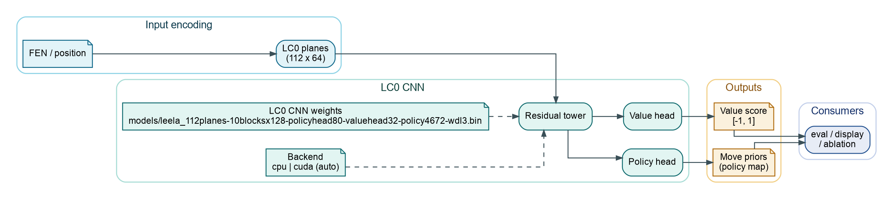

# LC0 (UCI Engine and Java Evaluator)

ChessRTK supports two LC0-related workflows:

1. LC0 as an external UCI engine for analysis and mining, usually with
   `.pb.gz` weights.
2. A Java LC0 value evaluator for `engine eval`, `engine builtin --lc0`,
   board display, and ablation overlays, using LC0J `.bin` weights.

Model weights are not checked into this repo. Local `models/*.bin` files are
gitignored; fetch the default LC0J weights with `./install.sh --models` or
download them manually from `models/README.md`.

## LC0 as a UCI Engine

If your engine protocol points to `lc0` (see `config/lc0.engine.toml`), you typically also need to set:

```toml
setup = [
  # ...
  "setoption name WeightsFile value /path/to/network.pb.gz",
]
```

Recommended workflow:

1. Download a network locally (gitignored):

   ```bash
   ./scripts/fetch_lc0_net.sh --url <URL> --out nets
   ```

2. Update your engine protocol TOML to point `WeightsFile` at that path.
3. (Optional) switch mining thresholds to the included `config/cli.lc0.config.toml` baseline (copy it over `config/cli.config.toml`).

Guardrail (fail if weights are tracked by git):

```bash
./scripts/check_no_weights_tracked.sh
```

Use the configured UCI engine through the normal engine commands:

```bash
crtk engine uci-smoke --nodes 1 --max-duration 5s
crtk engine analyze --fen "<FEN>" --max-duration 10s --multipv 3
crtk engine bestmove --fen "<FEN>" --format both --max-duration 5s
crtk puzzle mine --input seeds.txt --output dump/lc0.json --engine-instances 2
```

## Java LC0 Evaluator



Diagram source: `assets/diagrams/crtk-lc0-cnn.dot` (render with `dot -Tpng -Gdpi=160 -o assets/diagrams/crtk-lc0-cnn.png assets/diagrams/crtk-lc0-cnn.dot`).

The Java evaluator lives under `src/chess/nn/lc0/` and is used by LC0-aware
evaluation, display, and dataset paths.

Defaults:
- weights path: `models/leela_112planes-10blocksx128-policyhead80-valuehead32-policy4672-wdl3.bin` (`chess.nn.lc0.Model.DEFAULT_WEIGHTS`)
- backend: `auto`, which uses an available native GPU backend before falling
  back to the pure Java CPU evaluator

Backend selection (system properties):
- `-Dcrtk.lc0.backend=auto|cpu|cuda|rocm|amd|hip|oneapi|intel` (default `auto`)
- `-Dcrtk.lc0.threads=N` (CPU backend only)

Evaluate a position:

```bash
crtk engine eval --fen "<FEN>" --lc0 \
  --weights models/leela_112planes-10blocksx128-policyhead80-valuehead32-policy4672-wdl3.bin
```

Use LC0 value evaluation at the frontier of the built-in alpha-beta search:

```bash
crtk engine builtin --fen "<FEN>" --lc0 \
  --weights models/leela_112planes-10blocksx128-policyhead80-valuehead32-policy4672-wdl3.bin \
  --depth 2 --format summary
```

Display evaluator ablation and backend information:

```bash
crtk fen display --fen "<FEN>" --ablation --show-backend
```

Check native GPU backend availability:

```bash
crtk engine gpu
```

### Native GPU Backends (Optional)

The LC0 Java evaluator can run on the pure Java CPU backend with no native
library. Optional JNI backends are available for CUDA, ROCm/HIP, and oneAPI.
Use `-Djava.library.path=...` to point Java at the backend build directory and
`-Dcrtk.lc0.backend=...` to force a backend. Leaving the backend as `auto`
chooses the first available native backend and then falls back to CPU.

CUDA build example:

Build the JNI library:

```bash
cmake -S native/cuda -B native/cuda/build -DCMAKE_BUILD_TYPE=Release
cmake --build native/cuda/build -j
```

Then run Java with the library on `java.library.path`:

```bash
java -cp out \
  -Djava.library.path=native/cuda/build \
  -Dcrtk.lc0.backend=cuda \
  application.Main fen display --fen "<FEN>" --ablation --show-backend
```

See `native/cuda/README.md`, `native/rocm/README.md`, and
`native/oneapi/README.md` for backend-specific build notes.
