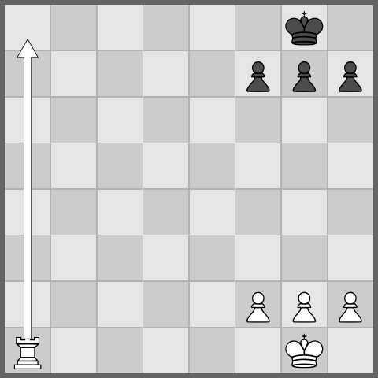

# Puzzle Mining

Mining is how a heap of positions becomes a labeled corpus of tactical and defensive puzzles. The `puzzle mine` command feeds seed positions to a pool of UCI engines, runs each candidate through a set of Filter DSL **gates**, and writes two parallel record files: the accepted puzzles and the rejected non-puzzles. Keeping both sides is deliberate. One run yields ready-to-use material for study books *and* the balanced positive/negative split a classifier wants. Nothing about the process is magic — you choose the seeds, the per-position node and time budgets, and the exact gate definitions, then read the result back with `record stats` and `record tag-stats`. Same inputs, same corpus.

What follows traces the workflow end to end: seeds, the `puzzle mine` run, the gates, the output files, conversion to PGN, and summarizing. The gate language has its own home in [Filter DSL](filter-dsl.md). For turning accepted puzzles into tensors or books, see [Datasets](datasets.md) and [Book Publishing](book-publishing.md).



*A mined tactical position, drawn by `crtk fen render --arrow a1a8`.*

## The pipeline at a glance

1. **Seed** — produce candidate positions, either from PGN games (via `fen pgn`) or by random legal generation.
2. **Search** — `puzzle mine` runs each seed through a pool of UCI engines, bounded by `--max-nodes` and `--max-duration`.
3. **Gate** — the accelerate, quality, winning, and drawing Filter DSL programs decide what counts as a puzzle.
4. **Write** — accepted rows go to `*.puzzles.json`, rejected rows to `*.nonpuzzles.json`.
5. **Summarize / convert** — `record stats`, `record tag-stats`, `puzzle pgn`, and `record export` turn the dumps into reports, games, and datasets.


## Step 1 — Seeds

Every mined puzzle begins life as a seed position, and there are two ways to get them.

### PGN games (via `fen pgn`)

Real games are the richest vein: actual losing moves and actual defensive resources are sitting there in the movetext, already vetted by someone who had to play them. Point `puzzle mine --input games.pgn` straight at a PGN file, or pre-extract a FEN seed list with `fen pgn` when you want to inspect or reuse it.

```bash
crtk fen pgn -i games.pgn -o seeds/fens.txt
crtk fen pgn -i games.pgn -o seeds/pairs.txt --pairs --mainline
```

The seed file is a plain FEN list:

- One FEN per line becomes that row's `position`.
- A `--pairs` file stores parent/child FENs so the move that *created* the candidate is preserved.
- `--mainline` keeps only mainline positions; omit it to include variation positions too.

Blank lines and lines beginning with `#` or `//` are ignored, so annotate your seed files however you like.

### Random legal positions

Drop `--input` and `puzzle mine` invents its own positions. Use `--random-count <n>` for a fixed batch or `--random-infinite` to keep generating across a long, continuous run.

```bash
crtk puzzle mine --random-count 200 --output dump/random/
crtk puzzle mine --random-infinite --output dump/stream/ --max-duration 3s
```

Three caps keep the random expansion from running away:

- `--max-waves N` — cap the number of expansion waves.
- `--max-frontier N` — cap the frontier size per wave.
- `--max-total N` — cap the total number of processed positions.

Add `--chess960` (or `-9`) to generate Chess960 starts and switch on Chess960 mode in the UCI protocol where the protocol template supports it.

## Step 2 — Running `puzzle mine`

Everything else is preamble or cleanup; this is the run itself. `puzzle mine` reads seeds, fans searches out across an engine pool, applies the gates, and streams accepted and rejected rows to disk as it goes.

```bash
crtk puzzle mine \
  --input seeds/fens.txt \
  --output dump/run.json \
  --engine-instances 4 \
  --max-nodes 5000000 \
  --max-duration 30s
```

### Core options

| Option | Purpose |
| --- | --- |
| `--input` / `-i PATH` | Seed file: `.txt` FEN list or `.pgn` games. Omit for random seeds. |
| `--output` / `-o PATH` | Output root file or directory; `-` streams to stdout. |
| `--engine-instances` / `-E N` | Size of the UCI engine pool (parallel searches). |
| `--max-nodes N` | Per-position node budget (`go nodes N`). |
| `--max-duration D` | Per-position wall-clock cap, e.g. `5s`, `2m`, or `60000`. |
| `--protocol-path` / `-P PATH` | Engine protocol TOML file to drive the search. |
| `--random-count N` | Number of random seeds when no `--input` is given. |
| `--random-infinite` | Keep generating random seeds for continuous runs. |
| `--chess960` / `-9` | Generate Chess960 seeds and enable Chess960 in the protocol. |

The engine and budget defaults come from your configuration; the flags above override them for one run. The two knobs that matter most pull in opposite directions: more `--engine-instances` buys throughput but costs CPU and memory, while a deeper `--max-nodes` buys puzzle quality at the price of speed.

### Smoke-check before a long job

A mining run can occupy a machine for hours, so spend thirty seconds proving the toolchain works before you commit to it:

```bash
crtk doctor
crtk config validate
crtk engine uci-smoke --nodes 1 --max-duration 5s
```

`doctor` inspects Java, config, the protocol, and local artifacts; `engine uci-smoke` confirms the configured engine actually launches and returns a move, which is the one failure mode that wastes the most of your time when it surfaces an hour in. See [Getting Started](getting-started.md) for first-run setup.

## Step 3 — The gates

A search result is not yet a puzzle. It becomes one only by surviving a sequence of Filter DSL programs — four of them, each overridable per run.

| Gate | Flag | Role |
| --- | --- | --- |
| Accelerate | `--puzzle-accelerate DSL` | Cheap prefilter that drops positions unlikely to survive the expensive checks, so the engine pool spends its budget where it matters. |
| Quality | `--puzzle-quality DSL` | Effort, depth, and shape requirements a row must meet before it can be accepted at all. |
| Winning | `--puzzle-winning DSL` | A decisive tactical resource: a single best winning move. |
| Drawing | `--puzzle-drawing DSL` | A defensive save: the only move that holds the draw. |

The acceptance rule combines them:

```text
quality AND (winning OR drawing)
```

Clear `quality` and match either `winning` or `drawing`, and the row is written as a puzzle; anything else lands in the non-puzzle file. Override any gate inline to redefine what "puzzle" means for a given run:

```bash
crtk puzzle mine \
  --input seeds/fens.txt \
  --output dump/sharp.json \
  --puzzle-quality 'gate=AND;nodes>=1000000;' \
  --puzzle-winning 'gate=AND;eval>=3.0;'
```

The full gate grammar — fields, operators, and worked examples — lives in [Filter DSL](filter-dsl.md).

## Step 4 — Outputs

`--output` takes either a directory or a file-like root, and either way a single run leaves behind two parallel files.

**Directory output** writes timestamped, named pairs:

- `standard-<timestamp>.puzzles.json`
- `standard-<timestamp>.nonpuzzles.json`
- Chess960 runs use `chess960-<timestamp>...` stems.

**File-like output** reuses the stem you give:

- `--output dump/run.json` writes `dump/run.puzzles.json` and `dump/run.nonpuzzles.json`.
- `.jsonl` roots follow the same stem behavior.

Each file is a JSON array that stays valid while rows are appended, so you can inspect a long run mid-flight and the downstream `record` commands can read it without any bespoke parsing.

## Step 5 — Summarize and convert

A finished run is two files of records. The `record` and `puzzle` commands are how you read them, reshape them, and turn them into something else.

### Summarize with `record stats` and `record tag-stats`

```bash
crtk record stats -i dump/run.puzzles.json
crtk record tag-stats -i dump/run.puzzles.json --top 25
```

- `record stats` summarizes a record file: counts, engines, and top tags.
- `record tag-stats` focuses on the tag distribution; `--top N` controls how many tags are listed.

The tags come from deterministic position and tactic tagging; [Tag Reference](tag-reference.md) lists the vocabulary.

### Merge, split, and compare

```bash
crtk record files -i dump/ -o dump/merged.puzzles.json --recursive --puzzles
crtk record analysis-delta -i dump/run.puzzles.json -o dump/run.analysis-delta.jsonl
```

- `record files` merges, filters, or splits record files; `--puzzles` / `--nonpuzzles` select one side, `--recursive` walks directories, `--max-records N` splits output.
- `record analysis-delta` compares parent/child analysis changes — useful when seeds carry parent FENs from `fen pgn --pairs`.

### Convert accepted puzzles to PGN

```bash
crtk puzzle pgn -i dump/run.puzzles.json -o dump/run.pgn
```

`puzzle pgn` renders a puzzle dump as PGN games. Open them in any chess GUI and judge the quality with your eyes, which is still the best filter for a few minutes of spot-checking.

### Export for training and study

```bash
crtk record export csv -i dump/run.puzzles.json -o dump/run.csv
crtk record export training-jsonl \
  -i dump/run.puzzles.json \
  -i dump/run.nonpuzzles.json \
  -o training/run.training.jsonl
crtk record dataset classifier \
  -i dump/run.puzzles.json \
  -i dump/run.nonpuzzles.json \
  -o training/classifier/run
```

Handing both the puzzle and non-puzzle files to `record dataset classifier` is the whole reason mining bothers to keep the rejected side: positives and negatives, balanced, in one step. See [Datasets](datasets.md) for the full tensor export surface, and [Book Publishing](book-publishing.md) for turning puzzle records into native PDFs with `book collection` and `book study`.

## Reproducibility checklist

Given the same seeds, engine, protocol, budgets, and gate definitions, mining is deterministic — which is worth nothing unless you actually capture all five. To keep a run reproducible:

1. Run `crtk doctor --strict` on the target machine and treat warnings as failures.
2. Run `crtk engine uci-smoke` with the protocol, thread, and hash settings you intend to mine with.
3. Mine a small batch first, check `record stats`, and open a few PGNs from `puzzle pgn`.
4. Keep the config file, the protocol TOML, and the exact command line alongside the produced dumps.

> Save the seed file, the gate flags, and the engine protocol together. They are the recipe — anyone with the same inputs can regenerate the same puzzle corpus.
