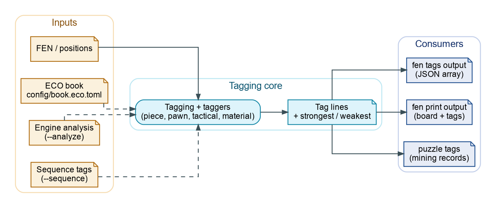

# Position and Piece Tags

ChessRTK emits compact, deterministic tags for positions, pieces, pawn
structure, king safety, material, tactics, engine evaluations, and puzzle
lines. Tags are used by:

- `fen tags`
- `puzzle tags`
- `record tag-stats`
- `fen text`
- `puzzle text`
- dataset and filtering workflows that consume tag strings



Diagram source: `assets/diagrams/crtk-tagging-flow.dot`.

## Tag Shape

Tags use a stable family prefix followed by ordered key/value fields:

```text
FAMILY: key=value key=value
```

Examples:

```text
META: to_move=white
FACT: status=normal
MATERIAL: balance=equal
PIECE: tier=very_strong side=white piece=knight square=f5
PAWN: structure=passed side=white square=e7
KING: safety=very_unsafe side=black
TACTIC: motif=pin side=black detail="pin: black rook e8 pins white bishop e2 to king"
CHECKMATE: pattern=smothered_mate
```

Tags are strings, but they are intentionally structured so they can be sorted,
deduplicated, filtered, counted, and converted into text.

For parser, family, identity, and fixture details, see the
[Tag Reference](tag-reference).

## Tag Families

| Family | Meaning |
| --- | --- |
| `META` | side to move, phase, source, difficulty, evaluation buckets, WDL, ECO/opening metadata |
| `FACT` | game status, check state, castling rights, en-passant state, center facts |
| `MATERIAL` | material balance, piece counts, bishop pair, exchange-style imbalances |
| `MOVE` | legal move and one-ply move-count facts |
| `PV` | principal variation facts from engine analysis |
| `CAND` | candidate move facts from engine analysis |
| `IDEA` | concise strategic ideas derived from static or analyzed facts |
| `THREAT` | threats discovered from analysis or reply searches |
| `KING` | king safety, castling state, shelter, back-rank and exposure facts |
| `PAWN` | pawn islands, doubled/isolated/passed/advanced/promotion facts |
| `PIECE` | piece placement tiers, activity, outposts, hanging pieces, defenders, attackers |
| `TACTIC` | pins, forks, skewers, discovered attacks, overloads, forcing motifs |
| `CHECKMATE` | mate status, winner/defender, delivery, and named mate patterns |
| `ENDGAME` | material endgame classes and practical endgame themes |
| `OPENING` | ECO and opening labels when an ECO table is configured |
| `SPACE` | space and center-control signals |
| `DEVELOPMENT` | undeveloped pieces and development lead |
| `MOBILITY` | mobility comparisons and restricted-piece signals |
| `INITIATIVE` | forcing-move and tempo signals |

Not every family appears for every position. Engine-derived families appear
when analysis is requested or supplied.

## Commands

Tag one position:

```bash
crtk fen tags --fen "<FEN>"
```

Include the FEN in the output:

```bash
crtk fen tags --fen "<FEN>" --include-fen
```

Tag a FEN file:

```bash
crtk fen tags -i positions.txt
```

Tag PGN mainlines or sidelines:

```bash
crtk fen tags --pgn games.pgn --delta --mainline
crtk fen tags --pgn games.pgn --delta --sidelines
```

Tag puzzle PVs:

```bash
crtk puzzle tags --fen "<FEN>" --multipv 3 --pv-plies 12
```

Use engine-enriched tags:

```bash
crtk fen tags \
  --fen "<FEN>" \
  --analyze \
  --max-duration 2s \
  --multipv 3 \
  --wdl
```

Use static tags only:

```bash
crtk puzzle tags --fen "<FEN>" --no-analyze --multipv 2
```

## Delta Tags

`--delta` emits JSONL rows that describe how tags change from a parent position
to a child position. This is useful for move explanations, puzzle-line
summaries, and training rows that need "what changed after this move" evidence.

```bash
crtk fen tags -i pairs.txt --delta --include-fen
```

For FEN pair input, each line can contain:

```text
<parent-fen> <child-fen>
```

For PGN input, parent/child relationships are created from the parsed movetext.

## Text Generation

The T5 commands consume tags and generate short natural-language summaries:

```bash
crtk fen text --fen "<FEN>" --model models/t5.bin --include-fen
crtk puzzle text --fen "<FEN>" --model models/t5.bin --include-fen
```

The text commands can use static tags or engine-enriched tags. Keep engine
limits explicit when using them in batch jobs:

```bash
crtk fen text \
  -i positions.txt \
  --model models/t5.bin \
  --analyze \
  --max-duration 2s \
  --multipv 2
```

## Interpreting Piece Tags

`PIECE` tags describe placement and activity. Common fields include:

- `tier`: placement tier such as `very_strong`, `strong`, `neutral`, `weak`,
  or `very_weak`
- `activity`: mobility or activity fact such as `low_mobility`
- `extreme`: strongest/weakest piece anchors for the whole board or one side
- `side`: `white` or `black`
- `piece`: `pawn`, `knight`, `bishop`, `rook`, `queen`, or `king`
- `square`: algebraic square

Treat these tags as auditable hints. Tactical and king-safety tags should carry
more weight than a generic placement tier when explaining a forcing sequence.

## Counting Tags

Summarize tags in record dumps:

```bash
crtk record tag-stats -i dump/run.puzzles.json
crtk record tag-stats -i dump/run.puzzles.json --top 50
```

Use this before training or publishing from mined data. It exposes class
imbalance, missing families, and overly common generic tags.
