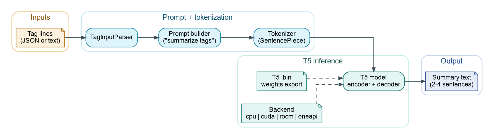

# T5 tag-to-text pipeline

ChessRTK includes a no-deps T5 runtime that turns tag lists into short prose summaries. It expects a custom `.bin` export and uses the same tag vocabulary as `crtk fen tags`.



Diagram source: `assets/diagrams/crtk-t5-pipeline.dot` (render with `dot -Tpng -Gdpi=160 -o assets/diagrams/crtk-t5-pipeline.png assets/diagrams/crtk-t5-pipeline.dot`).

## Inputs

- Tag lines as newline-separated text.
- Or a JSON array of strings (the default `crtk tags` output).
- A T5 `.bin` weights export passed via `--model`.

## Running position summaries

Use `fen text` when you want a short summary for one FEN or a FEN file:

```bash
crtk fen text --fen "<FEN>" --model models/t5.bin
crtk fen text -i seeds.txt --model models/t5.bin --include-fen
```

Useful options:

- `--include-fen`: emit JSON with `fen` and `summary`.
- `--analyze`: enrich tags with engine analysis before summarization.
- `--max-new <n>`: cap generated tokens, default `128`.
- `--protocol|-p`, `--max-nodes`, `--max-duration`, `--multipv`, `--threads`, `--hash`, `--wdl`, `--no-wdl`: engine options used with `--analyze`.

## Running puzzle-line summaries

Use `puzzle text` when you want summaries for the root PV and expanded puzzle
continuations:

```bash
crtk puzzle text --fen "<FEN>" --model models/t5.bin --multipv 3 --pv-plies 12
crtk puzzle text --fen "<FEN>" --model models/t5.bin --include-fen --no-analyze
```

Related command:

```bash
crtk puzzle tags --fen "<FEN>" --multipv 3 --pv-plies 12
```

`puzzle tags` emits JSONL with per-move tag deltas. `puzzle text` runs the same
expanded positions through the T5 summarizer.

## Low-level runner

Pipe tags directly:

```bash
crtk fen tags --fen "<FEN>" | java -cp out chess.nn.t5.Main --model /path/to/t5.bin
```

Or read from a file:

```bash
java -cp out chess.nn.t5.Main --model /path/to/t5.bin --input tags.txt
```

Options:

- `--model <path>` optional (defaults to `t5-model-path` from `config/cli.config.toml`).
- `--input <path>` optional (reads stdin if omitted).
- `--max-new <n>` max generated tokens (default `128`).
- `--debug` prints token counts and top logits.

## Backends

By default the runner uses the CPU path. You can override the backend selection with:

- `-Dcrtk.t5.backend=auto|cpu|cuda|rocm|oneapi`

When optional native backends are present, they are tried in the requested order with CPU fallback.
