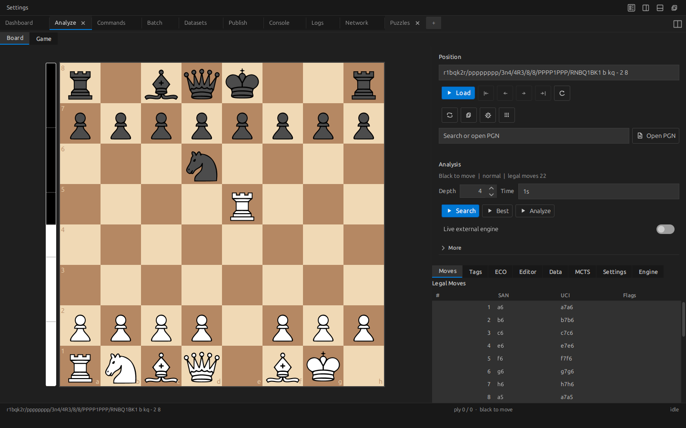
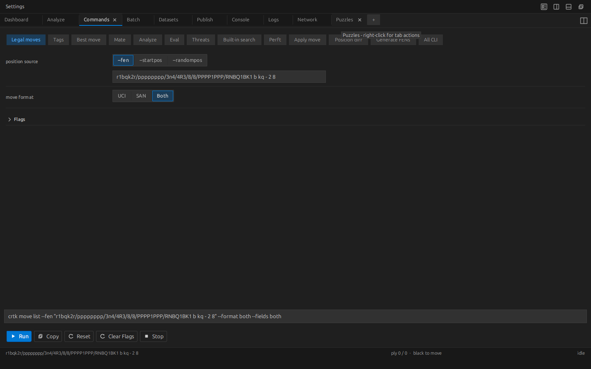
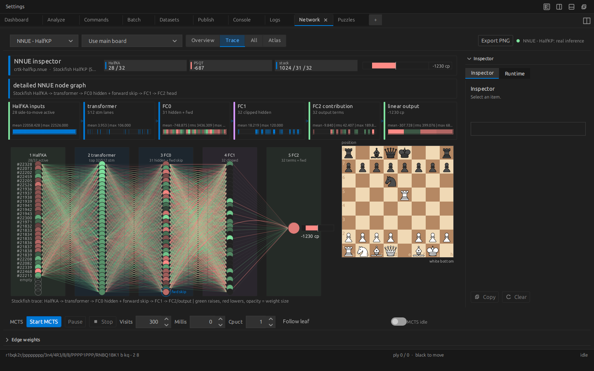

# Desktop Workbench

The Workbench is the same chess core as the CLI, with a board in front of it. There is no second engine, no second evaluator, no parallel implementation that drifts out of sync — a position you analyze in the GUI, a command you assemble in a form, and a dataset you inspect in a panel all resolve through the code path you would hit from a shell. Reach for the Workbench when a task wants a live board, a preview pane, or a command you'd rather click together than memorize. Reach for the [CLI](command-reference.md) when you want scripting, CI, stable text output, or a batch run that doesn't need a human watching it.

## What you can do

- Analyze positions and PGNs on an interactive board with legal-move overlays, deterministic tags, an ECO opening tree, post-game review, endgame tablebase status, and study authoring.
- Play full games against in-process alpha-beta/classical preset opponents, with Custom controls for MCTS and neural-evaluator experiments.
- Run deterministic built-in engine gauntlets from the Engine surface.
- Build any `crtk` command as a guided form, with validation and a live preview of the exact command text.
- Run batch jobs over FEN lists and command scripts, then watch progress and collect artifacts.
- Load, validate, and chart exported datasets and records.
- Preview publishing output (diagrams, books, studies, collections, covers) before rendering a PDF.
- Practice and inspect mined puzzles interactively.
- Visualize neural-network internals for NNUE, LC0 CNN, BT4, and OTIS.

## Launch

Once ChessRTK is installed, `ChessRTK Workbench` appears in your applications menu. The same window opens from a shell, through either the `workbench` area or its `gui` alias:

```bash
crtk workbench
crtk gui
crtk workbench --fen "<FEN>"
crtk workbench --flip
```

If the launcher script isn't on your path, point Java at the built classes:

```bash
java -cp out application.Main workbench --fen "<FEN>"
```

There are only three launch options, and they match what the CLI reports:

| Option | Effect |
| --- | --- |
| `--fen FEN` | Open on a specific position (default: the standard start FEN) |
| `--flip` / `--black-down` | Render the board with Black at the bottom |
| `-h` / `--help` | Print workbench launch help |

## Registered views

The Workbench currently registers eight top-level views. Older names such as
Analyze, Play, Solve, Relations, Draw, Network, MCTS, Tree, Gauntlet, Batch, and
Commands are modes or workflows inside these views, not separate top-level tabs.

| View | Modes and workflows | Purpose |
| --- | --- |
| Dashboard | Session overview, health, recent jobs, artifacts | The default operational overview |
| Board | Analyze, Play, Solve, Relations, Draw | The shared board workspace for positions, games, puzzles, overlays, and annotation |
| Run | Command builder and batch-style templates | GUI forms that build and run real `crtk` commands |
| Datasets | Dataset loaders, summaries, charts, sample inspection | Loading, validation, summaries, and charts for exported data |
| Publish | Diagram, book, study, collection, and cover previews | Publishing workflow previews before rendering PDFs |
| Engine Lab | Network, MCTS, Tree, Gauntlet | Neural, search-tree, and self-play engine diagnostics |
| Console | Live command output | Terminal-style progress and stdout/stderr display |
| Logs | Persisted job logs and artifacts | The durable audit trail for completed runs |

## Board view

Board is the shared position and game workspace. Its mode switcher hosts Analyze,
Play, Solve, Relations, and Draw. The board sits in the middle, surrounded by
the mode-specific tools for the current task: move navigation, the legal-move
list, deterministic tags, an ECO opening tree, deterministic post-game review
with retry jumps, study TOML authoring from the current line,
endgame/tablebase-hit status, a board editor for arbitrary setups, puzzle
practice, tactical-incidence overlays, and freehand annotation/export controls.
Load a PGN in Analyze mode and you step through the game from the same shared
board surface.



The board sees the world the way the CLI does: identical move generation, identical FEN/SAN/UCI handling, identical Chess960 support. The tags on the board are the ones `fen tags` produces, down to the bit. Live analysis drives your configured external UCI engine — Stockfish or LC0 — the same way `engine analyze` does, MultiPV included.

The PGN explorer doubles as a lightweight database workspace. It indexes player/opening/result metadata, filters games reaching the current board position, removes exact duplicates, copies selected games, and can copy a prep report for the visible games or named player query.

### Where to find the new analysis tools

| Tool | Path |
| --- | --- |
| Opening tree | Board -> Analyze -> Tools -> Opening Tree, or the side rail ECO tab |
| Post-game review and retry | Board -> Analyze -> Tools -> Review, or Board -> Analyze -> Game -> Study / Review / Database -> Review Game |
| PGN database workspace | Board -> Analyze -> PGN Database, or Board -> Analyze -> Game -> Study / Review / Database -> PGN Database |
| Player prep report | PGN Database -> Prep Report after loading/searching PGNs |
| Engine gauntlet manager | Engine Lab -> Gauntlet |
| Endgame/tablebase panel | Board -> Analyze -> Tools -> Endgame, or the side rail Endgame tab |
| Study/repertoire authoring | Board -> Analyze -> Tools -> Study, or Board -> Analyze -> Game -> Study / Review / Database -> Author Study |

The command palette also exposes the same workflows by name: Opening tree, Review game, Author study, Endgame tablebase, PGN database, Player prep report, and Open engine gauntlet.

## Board / Play

Board / Play runs a full human-versus-engine game from the start position, the current board, or a pasted FEN. The named preset bots all use alpha-beta search with the always-available classical evaluator; their Elo changes adjust the search budget and move sampling, not the backend. Choose Custom to expose the two backend selectors:

- **Search** chooses the move-picking algorithm: `Alpha-Beta` or `MCTS`.
- **Network** chooses the leaf evaluator: `Classical`, `NNUE`, `CNN` (LC0), or `OTIS`.

Both opponents run in-process. Play never spawns an external process.

- `Alpha-Beta` is iterative deepening with a transposition table, null-move pruning, and quiescence, scoring leaves with the chosen evaluator.
- `MCTS` is the in-process Monte Carlo Tree Search over the chosen policy/value backend. The CLI's `engine builtin --search mcts` path uses the same family, while the default classical/NNUE CLI path uses alpha-beta; both stay inside the JVM rather than reaching for a UCI engine.

The Network selector decides which local model loads:

| Network | Backend |
| --- | --- |
| `Classical` | Hand-crafted evaluation, no model file required |
| `NNUE` | `models/crtk-halfkp.nnue` |
| `CNN` | The configured ChessRTK LC0 CNN `.bin` weights |
| `OTIS` | The configured OTIS policy/WDL weights |

If a neural model is missing or won't load, Play drops back to classical evaluation rather than refusing to start — you get a game, just a weaker one. The LC0 CNN and BT4 paths are real, playable evaluators, but they are simplified and not bit-exact reproductions of upstream LC0/BT4; [LC0 networks](lc0.md) covers exactly where the fidelity stops.

> Important: Play is in-process only. Whatever external UCI engine you've configured (Stockfish, full LC0) backs the Workbench's live analysis and the engine command forms — never the Play opponent.

## Run view

Run is the CLI rendered as forms. Pick an area and action — `engine bestmove`, `puzzle mine`, `record dataset npy`, `fen tags` — and the form sorts the inputs into required fields, mutually exclusive choices, and optional flags, validating as you go. The exact `crtk` command takes shape in front of you while you fill it in, ready to copy into a script or run on the spot.



Since every form lands on a real CLI command, this doubles as a way to learn the surface area: assemble a command by clicking, read off its flags, then lift the generated text into a script for reproducible runs. The [Command Reference](command-reference.md) documents what each form mirrors.

The `Review game` command template mirrors `crtk review game --to-study`: choose a PGN, keep the shared engine budget fields explicit, and run the CLI to produce review JSONL, study JSONL, and Record sidecars. The Workbench preview is the runnable command; later review panels consume those files instead of computing separate verdicts.

The local PGN store also has first-class Run templates for the non-destructive
database path: `pgn import`, `pgn find`, `pgn show`, and `pgn stats`. Use the
command palette entries `PGN import`, `PGN find`, `PGN show`, `PGN stats`, and
`Review game command` to jump directly to those templates. The destructive
store-maintenance verbs, `pgn delete` and `pgn compact`, remain available through
the `All CLI` template.

## Batch jobs

Batch work now lives in Run as command templates and multi-line inputs. Sweep a
FEN list through an engine command, or run a command script — one `crtk` command
per non-comment line — exactly as `batch run` would. It tracks progress, breaks
out per-row results, and gathers the output, so a large mining or export pass
never has to leave the GUI. Anything long-running reports into Console and
persists into Logs.

## Datasets

The Datasets tab opens up whatever the export pipeline produced — the tensors from `record dataset npy`, `record dataset lc0`, and `record dataset classifier`, and the JSONL rows from the `record export ...-jsonl` family — and reports shapes, counts, label distributions, and charts. The point is to catch a broken or skewed training set here, before a trainer spends hours on it. See [Datasets](datasets.md) for the export formats.

## Publishing previews

The Publish tab shows you the PDF before you pay for the render. It previews single diagrams (`book pdf`), puzzle collections (`book collection`), annotated studies (`book study`), book interiors (`book render`), and covers (`book cover`). The whole publishing stack is built in — no LaTeX, no external toolchain to install. See [Book publishing](book-publishing.md) for the manifest formats and the full option set.

## Board / Solve

Board / Solve is where you actually solve the things you mined. Load the
`*.puzzles.json` output of `puzzle mine`, work a position on the board, then
reveal the principal variation and the move-by-move tags — the same
deterministic tagging behind `puzzle tags`. See [Puzzle mining](mining.md) for
how the sets are produced and gated by the Filter DSL.

## Engine Lab

Engine Lab hosts the implementation-facing engine views. Network opens up the
neural networks the toolkit has loaded — NNUE, the LC0 CNN, BT4, OTIS — and
shows what they're doing: loaded-model state, inference state, feature boards,
activation summaries, atlases, trace views, runtime information, and exportable
visualizations. MCTS and Tree inspect the in-process PUCT/MCTS search, including
root moves and tree exports. Gauntlet runs reproducible built-in engine
self-play; it builds the exact `testing.SelfPlayGauntlet` JVM command, runs it
in a child process, and streams W-D-L/Elo output into the panel.

## Board / Relations

Board / Relations draws the OTIS *tactical incidence* graph — the twelve typed relation channels `A(x)` the oriented-tactical-sheaf network ingests — as colour-coded arrows over a board: us/them attacks and defenses, king-zone pressure, occlusion-aware bishop/rook/queen rays, knight and pawn attacks, and absolute-pin candidates. Toggle channels on and off, set the arrow opacity, and point it at the current analysis position (Sync to board) or a pasted FEN. The edges are computed deterministically from the position alone — no model file needed — and are the exact same `A(x)` the CLI `fen relations` command renders and the network reads.



Read this as a research and debugging aid, not ground truth about a reference engine. The networks are usable evaluators, but the LC0 CNN and BT4 paths are simplified and not bit-exact equivalents of upstream inference — so the activations are faithful to ChessRTK's implementation, which is not quite the same thing as faithful to LC0 or BT4.

## Console and Logs

Console and Logs are first-class registered views, which means they can be split,
duplicated, and resized beside other views. Console streams command output with
terminal-style progress handling, so a running export or mining job reads much
like it would in a shell. Logs holds onto job logs and artifacts after a run ends
— your audit trail of what was produced and where it landed. See [Outputs and
logs](outputs-and-logs.md) for the on-disk layout.

## Keyboard and layout

- Arrow keys navigate game positions; `Home` and `End` jump to the start or end of the line.
- Tabs can be opened, closed, duplicated, and split into editor groups.
- The layout supports left, right, top, bottom, and quadrant splits.
- Settings include light and dark appearance, board coordinates, animations, highlights, eval-bar behavior, and external-engine options.

## Related pages

- [Workbench Design Guide](workbench-design-guide.md) - visual direction and contributor rules for Workbench UI changes.
- [Getting Started](getting-started.md) — install, configure, and run your first commands.
- [Command Reference](command-reference.md) — every area and action the command forms mirror.
- [In-house engine](in-house-engine.md) — the alpha-beta and MCTS search behind Play and `engine builtin`.
- [LC0 networks](lc0.md) — the LC0 CNN evaluator and its fidelity limits.
- [Datasets](datasets.md) and [Book publishing](book-publishing.md) — what the Datasets and Publish tabs work with.
